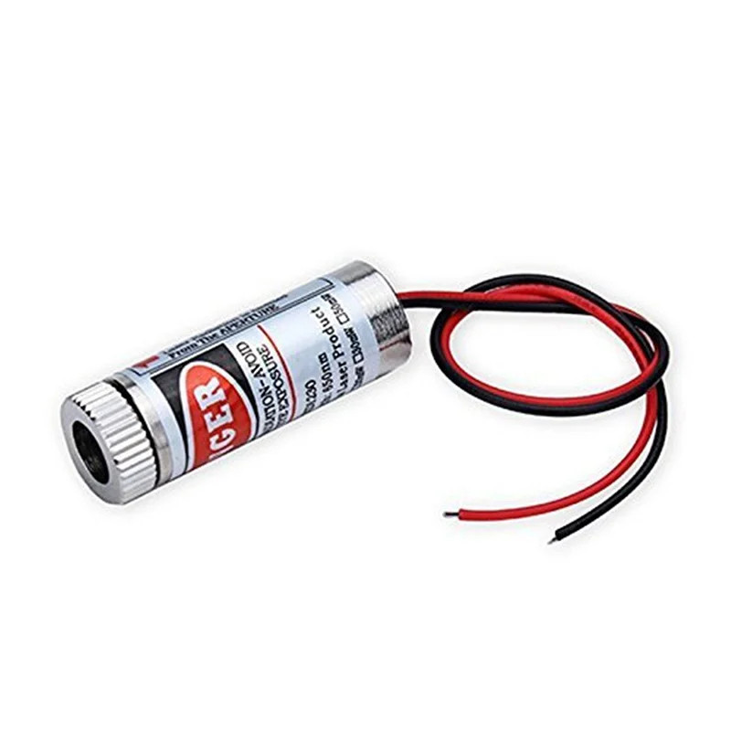
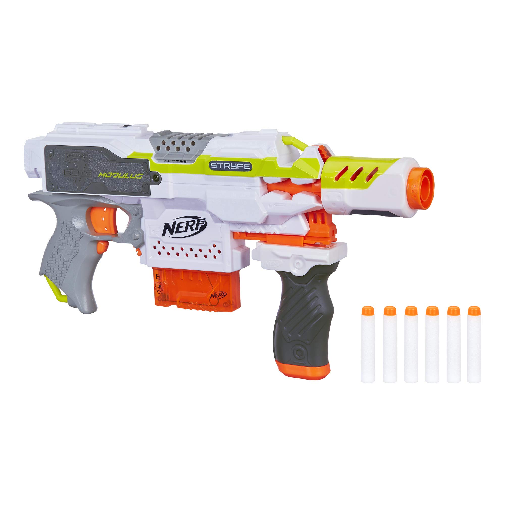
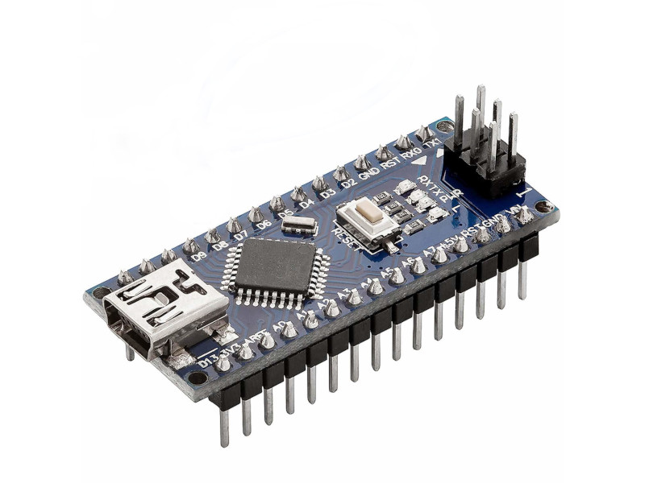
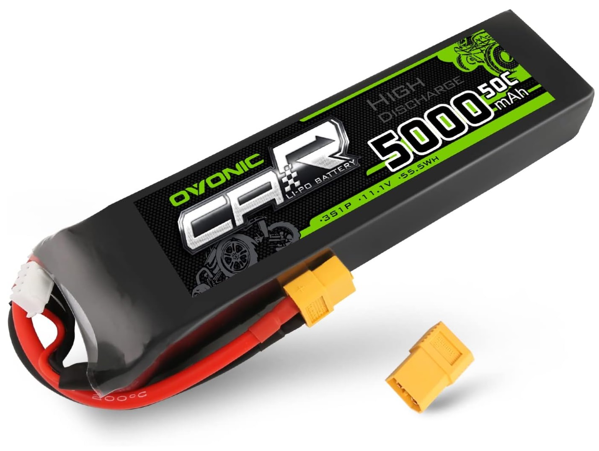
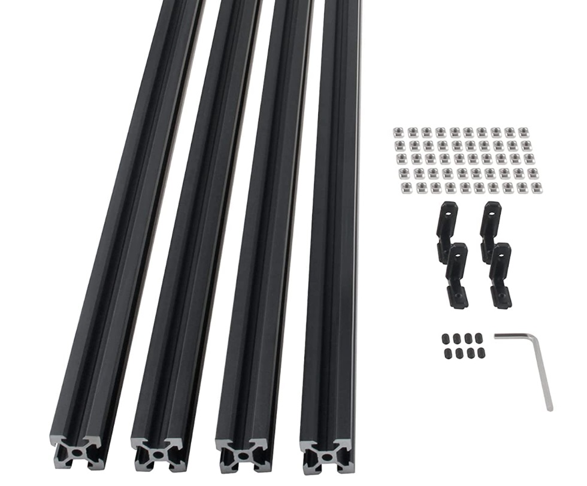
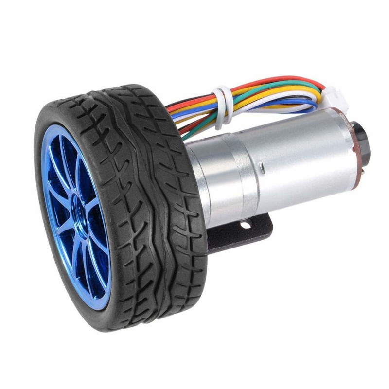
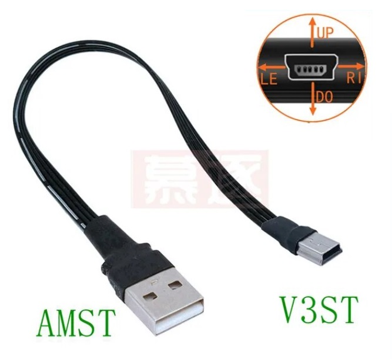

# Bill of Materials

| Qty. | Item                                            | Image                                         | Description                                                  | Link                                                         | Price            |
| ---- | ----------------------------------------------- | --------------------------------------------- | ------------------------------------------------------------ | ------------------------------------------------------------ | ---------------- |
| 1    | [Laser pointer](./BOM/laser_pointer.md)         |                    | GALDOEP 650nm 5mW red laser diode module 3-5V                | [Amazon](https://www.amazon.es/dp/B09J3TB26H)                | 9.99€ (3  units) |
| 1    | [Nerf](./BOM/nerf.md)                           |              | Nerf Modulus Stryfe                                          | [Amazon](https://www.amazon.es/gp/product/B072PYD365)        | 42.07€           |
| 1    | Nano                                            |             | AZDelivery AZ-Nano V3-Board w/ Atmega328 CH340               | [Amazon]()                                                   | 21.99€ (3 units) |
| 1    | Battery                                         |                  | OVONIC LiPo 3S 5000mAh 50C 11.1V with XT connector           | [Amazon]()                                                   | 39.99€           |
| 1    | [DC-DC Buck converter](./BOM/buck_converter.md) |           | ICQUANZX DC-DC 5A 5-32V input to 0.8-24V output              | [Amazon](https://www.amazon.es/dp/B07VQ89RZG)                | 21.99€ (3 units) |
| 1    | Linear actuator                                 |          | ETOPAR 12V linear actuator for car door locking              | [Amazon](https://www.amazon.es/gp/product/B08NG6LTY2)        | 16.79€ (4 units) |
| 1    | Structure                                       |                | CNCMANS 4 x 300mm EU2020-T anodized aluminium profiles with angle brackets and 50 M5 nuts | [Amazon](https://www.amazon.es/dp/B0BX648N6P)                | 22.00€ (1kit)    |
| 2    | Motor and wheel kit                             |  | 12V motor encoder and wheel kit (130rpm)                     | [Amazon](https://www.amazon.es/dp/B07WT22RNK)                | 23.92€           |
| 1    | USB flat cable 100mm                            |                | Straight USB (AMST) to straight Mini USB (V3ST)              | [Aliexpress](https://es.aliexpress.com/item/1005002551406991.html?spm=a2g0n.order_detail.order_detail_item.3.578739d32xzMxK&gatewayAdapt=glo2esp) | 6,91€(2 units)   |
| 1    | Raspberry Pi 5                                  |                                               |                                                              |                                                              |                  |

## 3D printed parts

Laser pointer holder 

https://grabcad.com/library/nerf-laserpointer-2-0-1

Nerf rail:

https://grabcad.com/library/nerf-rail-modelled-after-a-stryfe-1

Power door lock motor (12V car door actuator)

https://grabcad.com/library/power-door-lock-motor-1

Buck converter (LM2596 is similar)

https://grabcad.com/library/buck-converter-lm2596-1

Simon robot: https://github.com/simonllopez/mini_robot_hw 

( see https://esimonsite.com/proyectos/mini_robot/)