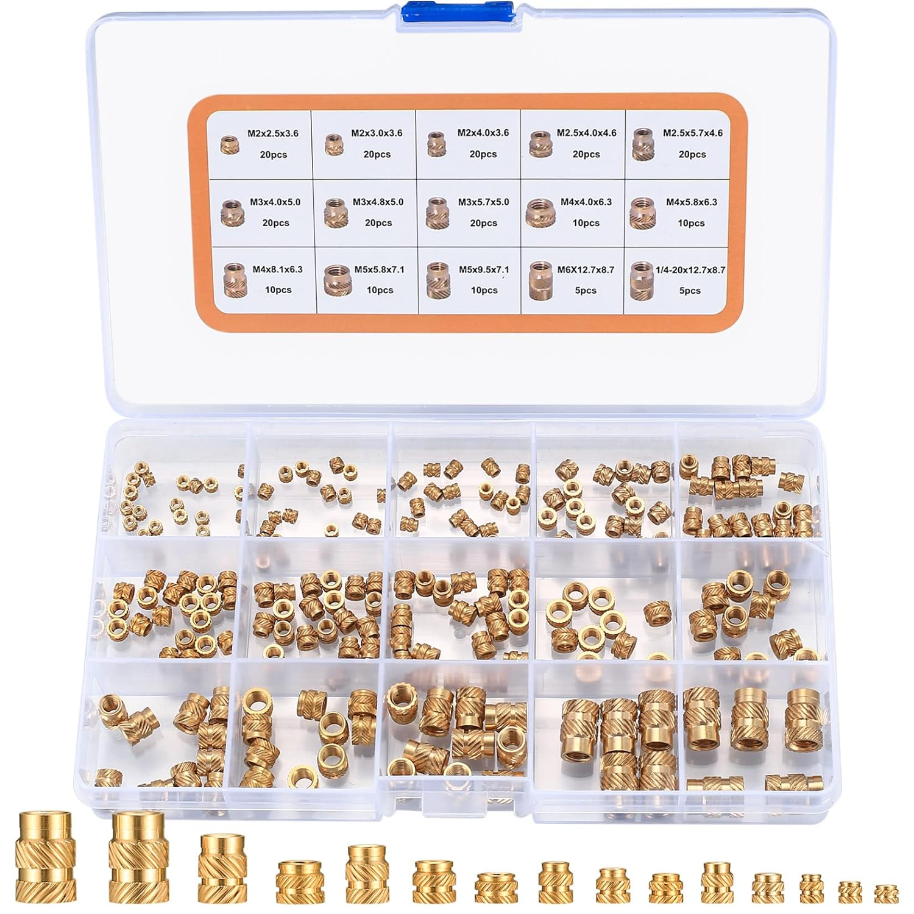
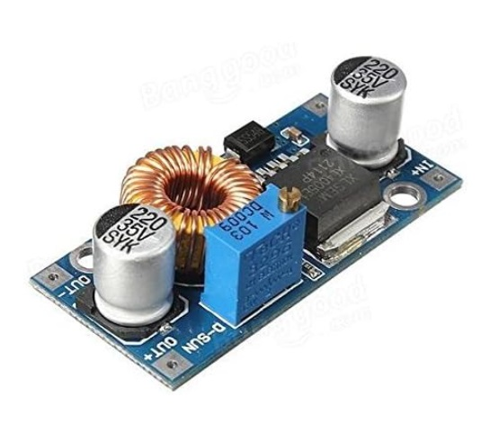
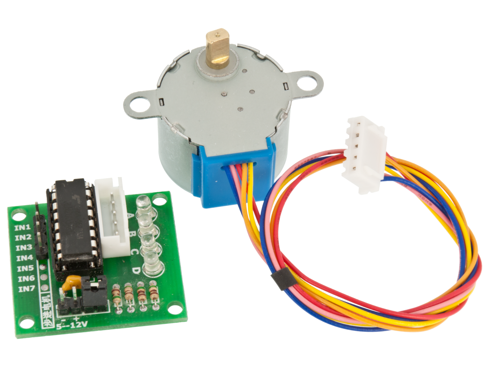
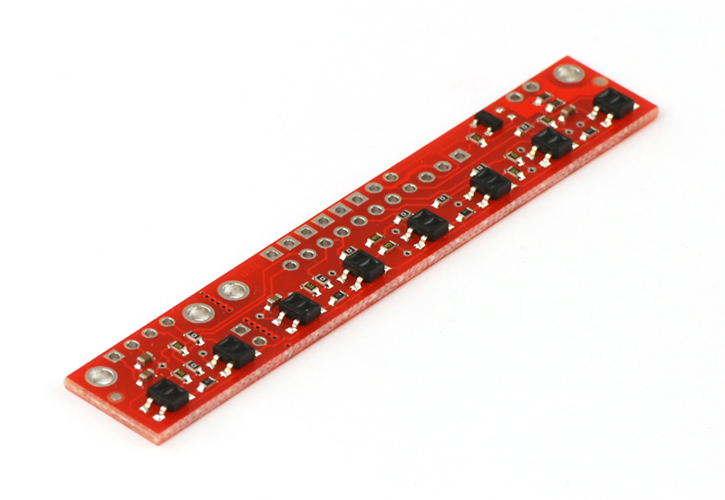

# Bill of Materials

Total approx price **498,47€** (+ cost of standards and consumables)

| Qty  | Item                                                | Image                                                        | Description                                                 | Link                                                         | Pack Price (€) | Pack Size | Unit Price (€) | Subtotal (€) |
| ---- | --------------------------------------------------- | ------------------------------------------------------------ | ----------------------------------------------------------- | ------------------------------------------------------------ | -------------- | --------- | -------------- | ------------ |
| 1    | [Structure](./BOM/Structure.md)                     |                               | CNCMANS 4 x 200mm EU2020-T anodized aluminium profiles      | [Amazon](https://www.amazon.es/dp/B0BX686QY5)                | 17.00          | 1         | 17.00          | 17.00        |
| many | [3D printed parts](./BOM/3D_printed_parts.md)       |                                                              |                                                             |                                                              |                |           |                | 0.00         |
| many | [Inserts](./BOM/inserts.md)                         |                                 | Heat set inserts                                            | [Amazon](https://www.amazon.es/gp/product/B0B2DMWFT2/)       | 10.99          | 220       | 0.05           | 10.99        |
| 1    | [Caster wheel](./BOM/caster.md)                     |                                  |                                                             | [Amazon](https://www.amazon.es/dp/B09MLVQWL7)                | 12.59          | 6         | 1.49           | 1.49         |
| 2    | Motor and wheel kit                                 |                 | 12V motor encoder and wheel kit (130rpm)                    | [Amazon](https://www.amazon.es/dp/B07WT22RNK)                | 23.92          | 1         | 23.92          | 47.84        |
| 1    | [L298N Motor driver](./BOM/motor_driver.md)         |                            |                                                             | [Amazon](https://www.amazon.es/gp/product/B077NY9RY6/ref=ppx_yo_dt_b_asin_title_o00_s01?ie=UTF8&psc=1) | 9.99           | 2         | 4.99           | 4.99         |
| 4    | Arduino Nano                                        |                            | AZDelivery AZ-Nano V3-Board w/ Atmega328 CH340              | [Amazon]()                                                   | 21.99          | 3         | 7.33           | 29.32        |
| 1    | Arduino Nano Shell                                  |              |                                                             | [Amazon](https://www.amazon.es/gp/product/B08T1ZXS7K/ref=ppx_yo_dt_b_asin_title_o00_s01?ie=UTF8&th=1) | 6.99           | 1         | 6.99           | 6.99         |
| 1    | Battery                                             |                                 | OVONIC LiPo 3S 5000mAh 50C 11.1V with XT connector          | [Amazon]()                                                   | 39.99          | 1         | 39.99          | 39.99        |
| 1    | [DC-DC Buck converter](./BOM/buck_converter.md)     |                          | ICQUANZX DC-DC 5A 5-32V input to 0.8-24V output             | [Amazon](https://www.amazon.es/dp/B07VQ89RZG)                | 21.99          | 3         | 7.33           | 7.33         |
| 1    | [Raspberry Pi 4B](./BOM/RPi_4B.md)                  |  | Raspberry Pi 4B 4Gb                                         | [Electronica Embajadores](https://www.electronicaembajadores.com/es/Productos/Detalle/LCRBPI4B4/modulos-electronicos/raspberry-pi/raspberry-pi-4-4gb-tarjeta-ordenador-sc0194-9/) | 99.03          | 0         | 99.03          | 99.03        |
| 1    | [Mega4 USB Hub](./BOM/mega4.md)                     |                              | UUGEAR MEGA4: 4-Port USB 3.1 PPPS Hub for Raspberry Pi 4B   | [The Pi Hut](https://thepihut.com/products/mega4-4-port-usb-3-1-ppps-hub-for-raspberry-pi-4) | £29.00         | 1         | £29.00         | £29.00       |
| 1    | USB flat cable 100mm                                |                               | Straight USB (AMST) to straight Mini USB (V3ST)             | [Aliexpress](https://es.aliexpress.com/item/1005002551406991.html?spm=a2g0n.order_detail.order_detail_item.3.578739d32xzMxK&gatewayAdapt=glo2esp) | 6.91           | 2         | 3.46           | 3.46         |
| 1    | Gamepad                                             |                                 | Logitech F710 Gamepad                                       | [Amazon](https://www.amazon.es/dp/B00CJAEX5M)                | 44.81          | 1         | 44.81          | 44.81        |
| 1    | Nerf                                                |                             | Nerf Modulus Stryfe                                         | [Amazon](https://www.amazon.es/gp/product/B072PYD365)        | 42.07          | 1         | 42.07          | 42.07        |
| 2    | [28BYJ-48_Stepper motor](./BOM/28BYJ-48_stepper.md) |                                 | 28BYJ-48 12V stepper motor with ULN2003A based driver board | [Amazon](https://www.amazon.es/Reland-Sun-28BYJ-48-ULN2003-controlador/dp/B09QQLMYWP/) | 3,57           | 1         | 7.14           | 7.14         |
| 1    | [Linear Actuator](./BOM/Linear actuator.md)         |                         | ETOPAR 12V linear actuator for car door locking             | [Amazon](https://www.amazon.es/gp/product/B08NG6LTY2)        | 16.79          | 4         | 4.20           | 4.20         |
| 1    | Relay                                               |                                   | 1 channel 5V relay                                          | [Amazon](https://www.amazon.es/gp/product/B09GY34ZFQ)        | 11.69          | 6         | 1.95           | 1.95         |
| 1    | [Laser pointer](./BOM/laser_pointer.md)             |                                   | GALDOEP 650nm 5mW red laser diode module 3-5V               | [Amazon](https://www.amazon.es/dp/B09J3TB26H)                | 9.99           | 3         | 3.33           | 3.33         |
| 2    | Micro switches                                      |                            | WANGCL micro switches                                       | [Amazon](https://www.amazon.es/gp/product/B0B1MMQ3RT/)       | 6.99           | 50        | 0.14           | 0.28         |
| 1    | [Line sensor](./BOM/line_sensor.md)                 |                                 | Pololu QTR-8RC reflectance sensor array                     | [Electronica Embajadores](https://www.electronicaembajadores.com/es/Productos/Detalle/SSIRQTR/sensores/sensores-de-infrarrojos/qtr-8rc-array-sensores-de-reflexion/) | 15.12          | 1         | 15.12          | 15.12        |
| 1    | [DTOF Lidar LD06](./BOM/LD06-lidar.md)              |                    | LD06 Lidar                                                  | [Amazon](https://www.amazon.com/-/es/Sensor-Lidar-LD06-frecuencia-educaci%C3%B3n/dp/B0B4VLQ1M9?th=1) | 63.18          | 1         | 63.18          | 63.18        |
| 1    | Camera                                              |                       | SainSmart Wide Angle Fish-Eye Camera for Raspberry Pi       | [Amazon](https://www.amazon.es/dp/B00N1YJKFS)                | 24.95          | 1         | 24.95          | 24.95        |

## Miscellaneous

| Qty  | Item                                                | Image                                                        | Description                                                  | Link                                                         | Pack Price (€) | Pack Size | Unit Price (€) | Subtotal (€) |
| ---- | --------------------------------------------------- | ------------------------------------------------------------ | ------------------------------------------------------------ | ------------------------------------------------------------ | -------------- | --------- | -------------- | ------------ |
| 0    | [Balance charger](./BOM/battery_charger.md)         |                         | WANGCL IMAX B6AC Lipo Battery charger B6 80W Digital LCD     | [Amazon](https://www.amazon.es/gp/product/B0B3GM8KX9/)       | 42.99          | 1         | 42.99          | 0.00     |
| 0    | [NEMA17 stepper motor](./BOM/NEMA17_stepper.md)     |                                                              | 12V NEMA17 bipolar stepper motor to use with a with L298N driver | [Electronica Embajadores](https://www.electronicaembajadores.com/es/Productos/Detalle/MMPP004/motores-servomotores-actuadores-lineales/motores-paso-a-paso/nema-17-motor-paso-a-paso-12-vcc-angulo-1-8-200-pasos-0-45n-m-42bygh40-1704a/) | 12.09          | 1         | 12.09      | 0.00         |
| 0    | [OLED](./BOM/OLED.md)                               |                                    | SSD1306 0.96" OLED display                                   | [Amazon](https://www.amazon.es/dp/B09GVTRB2W)                | 10.99          | 3         | 3.66           | 0.00         |
