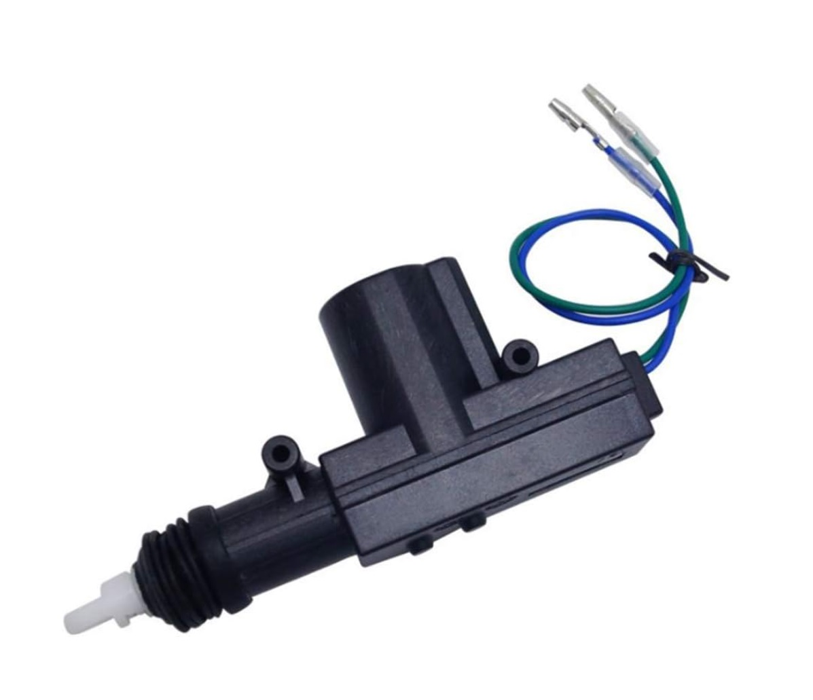

# Bill of Materials

| Qty. | Item                                                | Image                                         | Description                                                  | Link                                                         | Price                               |
| ---- | --------------------------------------------------- | --------------------------------------------- | ------------------------------------------------------------ | ------------------------------------------------------------ | ----------------------------------- |
| 1    | [Laser pointer](./BOM/laser_pointer.md)             |                    | GALDOEP 650nm 5mW red laser diode module 3-5V                | [Amazon](https://www.amazon.es/dp/B09J3TB26H)                | 9.99€ (3  units)                    |
| 1    | [Nerf](./BOM/nerf.md)                               |              | Nerf Modulus Stryfe                                          | [Amazon](https://www.amazon.es/gp/product/B072PYD365)        | 42.07€                              |
| 4    | Nano                                                |             | AZDelivery AZ-Nano V3-Board w/ Atmega328 CH340               | [Amazon]()                                                   | 21.99€ (3 units)                    |
| 1    | Battery                                             |                  | OVONIC LiPo 3S 5000mAh 50C 11.1V with XT connector           | [Amazon]()                                                   | 39.99€                              |
| 1    | [DC-DC Buck converter](./BOM/buck_converter.md)     |           | ICQUANZX DC-DC 5A 5-32V input to 0.8-24V output              | [Amazon](https://www.amazon.es/dp/B07VQ89RZG)                | 21.99€ (3 units)                    |
| 1    | Linear actuator                                     |          | ETOPAR 12V linear actuator for car door locking              | [Amazon](https://www.amazon.es/gp/product/B08NG6LTY2)        | 16.79€ (4 units)                    |
| 1    | Structure                                           |                | CNCMANS 4 x 200mm EU2020-T anodized aluminium profiles with angle brackets and 50 M5 nuts | [Amazon](https://www.amazon.es/dp/B0BX686QY5)                | 22.00€ (1kit)                       |
| 2    | Motor and wheel kit                                 |  | 12V motor encoder and wheel kit (130rpm)                     | [Amazon](https://www.amazon.es/dp/B07WT22RNK)                | 23.92€ (1 kit)                      |
| 1    | USB flat cable 100mm                                |                | Straight USB (AMST) to straight Mini USB (V3ST)              | [Aliexpress](https://es.aliexpress.com/item/1005002551406991.html?spm=a2g0n.order_detail.order_detail_item.3.578739d32xzMxK&gatewayAdapt=glo2esp) | 6,91€ (2 units)                     |
| 1    | Raspberry Pi 4B 4Mb                                 |                                               | Raspberry Pi 4B 4Mb                                          |                                                              |                                     |
| 0    | [OLED](./BOM/OLED.md)                               |                     | SSD1306 0.96" OLED display                                   | [Amazon](https://www.amazon.es/dp/B09GVTRB2W)                | 10.99€ (3 units)                    |
| 2    | [28BYJ-48_Stepper motor](./BOM/28BYJ-48_stepper.md) |                  | 28BYJ-48 12V stepper motor with ULN2003A based driver board  | local shop                                                   | 6,75€ (2 units)                     |
| 0    | [NEMA17 stepper motor](./BOM/NEMA17_stepper.md)     |                                               | 12V NEMA17 bipolar stepper motor to use with a with L298N driver | Electronica Embajadores                                      | ?                                   |
| many | [Inserts](./BOM/inserts.md)                         |                  | Heat set inserts                                             | [Amazon](https://www.amazon.es/gp/product/B0B2DMWFT2/)       | 10,99€ (220 parts M2-M6 assortment) |
| 1    | Relay                                               |                    | 1 channel 5V relay                                           | [Amazon](https://www.amazon.es/gp/product/B09GY34ZFQ)        | 11,69€ (6 units)                    |
| 2    | Micro switches                                      |             | WANGCL micro switches                                        | [Amazon](https://www.amazon.es/gp/product/)                  | 6,99€ (50 units)                    |
| 1    | [Camera](./BOM/Camera.md)                           |        | SainSmart Wide Angle Fish-Eye Camera for Raspberry Pi        | [Amazon](https://www.amazon.es/dp/B00N1YJKFS)                | 24,95€                              |
| 1    | Gamepad                                             |                  | Logitech F710 Gamepad                                        | [Amazon](https://www.amazon.es/dp/B00CJAEX5M)                | 44,81€                              |
|      |                                                     |                                               |                                                              |                                                              |                                     |

## 3D printed parts

Laser pointer holder 

https://grabcad.com/library/nerf-laserpointer-2-0-1

Nerf rail:

https://grabcad.com/library/nerf-rail-modelled-after-a-stryfe-1

Power door lock motor (12V car door actuator)

https://grabcad.com/library/power-door-lock-motor-1

Buck converter (LM2596 is similar)

https://grabcad.com/library/buck-converter-lm2596-1

Simon robot: https://github.com/simonllopez/mini_robot_hw 

( see https://esimonsite.com/proyectos/mini_robot/)

### Base plate 

#### Version 2 printed 10/12/23

3D printing took 12h 8' in low quality, 140g after scaling in z to 75% to reduce to 3mm thickness.

Lessons learned: 

* 3mm thickness is enough. Perhaps 4mm is good only where the fixing screws attach the plate to the frame
* 4 screws are enough to fix the plate. Ideally use 10mm M5 screws with phillips or internal hex head and one washer 
* Make open slots instead of holes for ease of installation. 5mm holes are too tight in practice, try 5.2mm
* make raised flanges in the corners of the plate to facilitate aligning the plate to the frame

Next steps: 

* position elements in the plate and holes to fix them.
* make modifications to FreeCAD model
