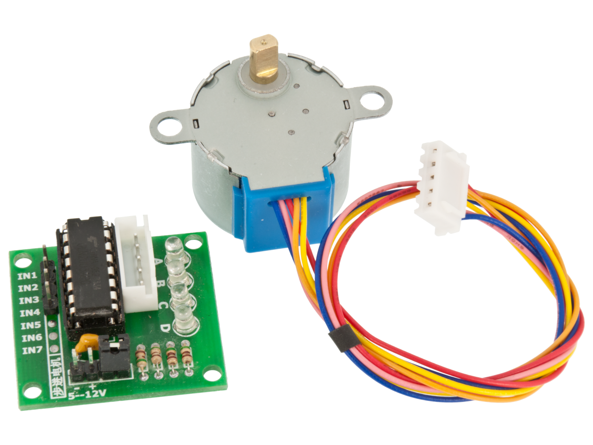

# 12V 28BYJ-48 Stepper motor / ULN2003A-based driver board

Stepper motor 28BYJ-48 with ULN2003A based driver board. 

The board can be connected directly to a microcontroller and controls the motor by sending alternating pulses to the motor coils. The onboard LEDs indicate which coils/outputs are active. 

* Supply voltage: 12VDC
* Dimensions (driver): 29 x 21mm
* Dimensions (motor): ø28x19mm
* Poles: 4 (unipolar)
* Gear ratio: 64:1
* Step angle: 5.625° (/64)
* Steps per rev.: 4096
* DC resistance: 200ohm (±7%)
* Shaft: 5mm flat

Data sheet 12V: https://electronperdido.com/wp-content/uploads/2018/08/28BYJ-12V-datasheet.pdf

Data sheet 5V: https://www.makerguides.com/wp-content/uploads/2019/04/28byj48-Stepper-Motor-Datasheet.pdf

Two basic tutorials (refer to 5V motor):

https://www.makerguides.com/28byj-48-stepper-motor-arduino-tutorial/

https://lastminuteengineers.com/28byj48-stepper-motor-arduino-tutorial/

Joystick + Stepper Elegoo tutorial with code:  https://www.youtube.com/watch?v=5WTLD2XcL5A&t=101s

Understanding joysticks tutorial: https://www.youtube.com/watch?v=B6YEQj4d5WU
