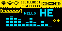

# SSD1306 OLED 

Tutorial (in Spanish): https://www.youtube.com/watch?v=cWgWvNhWg-A&t=10s

SSD1306 is a popular controller for OLED screens

 resolution 128x64

I2C communication requires only 4 pins: GND, VCC and 

SDA > A4

SCL > A5

Install libraries : Adafruit SSD1306 + dependencies (adafruit GFX library: a graphical library)

There is a demo example

Check if the I2C address is 0x3D or 0x3C

Boilerplate code:

```c++
#include <Wire.h> // I2C comms
#include <Adafruit_GFX.h> // graphical library
#include <Adafruit_SSD1306.h> // SSD1306 controller library

#define SCREEN_WIDTH 128 // OLED display width, in pixels
#define SCREEN_HEIGHT 64 // OLED display height, in pixels

// Declaration for an SSD1306 display connected to I2C (SDA, SCL pins)
// The pins for I2C are defined by the Wire-library.
// For arduino UNO or NANO:       A4(SDA), A5(SCL)
#define OLED_RESET     -1 // Reset pin # if screen has 5th wire (or -1 otherwise)
#define SCREEN_ADDRESS 0x3C // try 0x3D or 0x3C
// create instance of display
Adafruit_SSD1306 display(SCREEN_WIDTH, SCREEN_HEIGHT, &Wire, OLED_RESET); // &Wire is pointer to I2C comms

void setup() {
  // initialize serial port at 9600 bauds
  Serial.begin(9600);

  // initialize screen
  // SSD1306_SWITCHCAPVCC to generate internally 3.3V to power the display or SSD1306_EXTERNALVCC to power it externally
  if (!display.begin(SSD1306_SWITCHCAPVCC, SCREEN_ADDRESS)) {
    Serial.println(F("SSD1306 allocation failed"));
    for (;;); // Loop forever
  };

  display.clearDisplay(); // clear screen
  display.setTextSize(2); // 1 - 7... (1: 4x8pix, 2: 8x16pix, ...) 
  display.setTextColor(WHITE);
  display.setCursor(3, 1); // top left origin in pixels
  display.println("HELLO");
  display.setCursor(5, 17); // top left origin in pixels
  display.println("WORLD!");
  display.display(); //draw

}
void loop() {};

```

Power consumption: according to https://bitbanksoftware.blogspot.com/2019/06/how-much-current-do-oled-displays-use.html,  for text (~50% pixels at 100%) is around 10mA so at 5V is ~50mW 

## Useful references

* A tool to design pixelart: https://www.pixilart.com/



* Check out wokwi online emulator https://wokwi.com/ for Arduino, ESP32 and Raspberry Pi Pico and animation maker https://animator.wokwi.com/

  Using the wokwi emulator I made code to display distance measurements, check:

  * parking_sensor: https://wokwi.com/projects/380210366387901441
  * distance_measurement: https://wokwi.com/projects/380210201131269121


* Check out also this image2cpp tool to make byte arrays from images and viceversa: http://javl.github.io/image2cpp/

