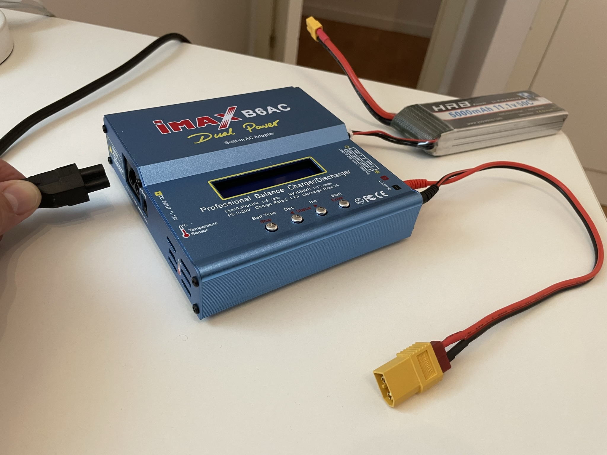
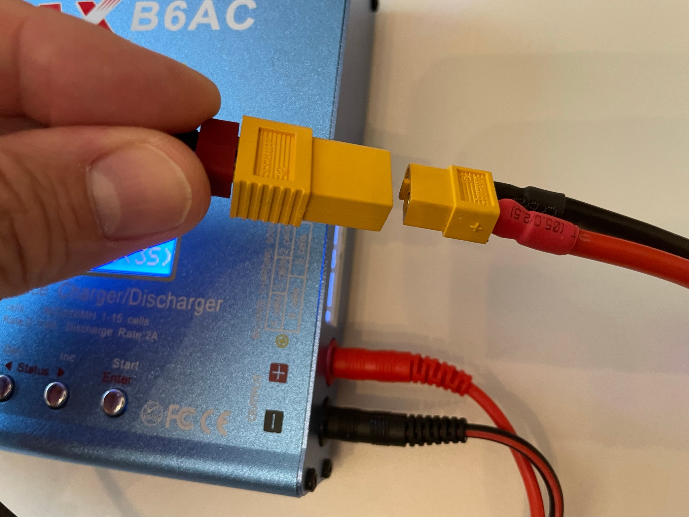
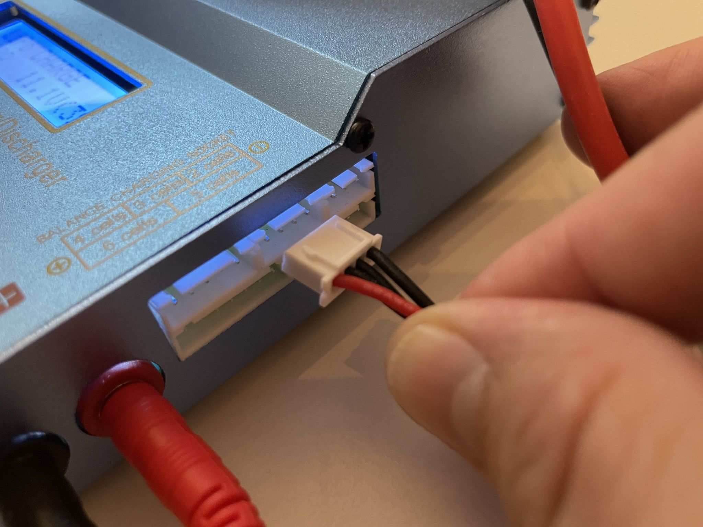
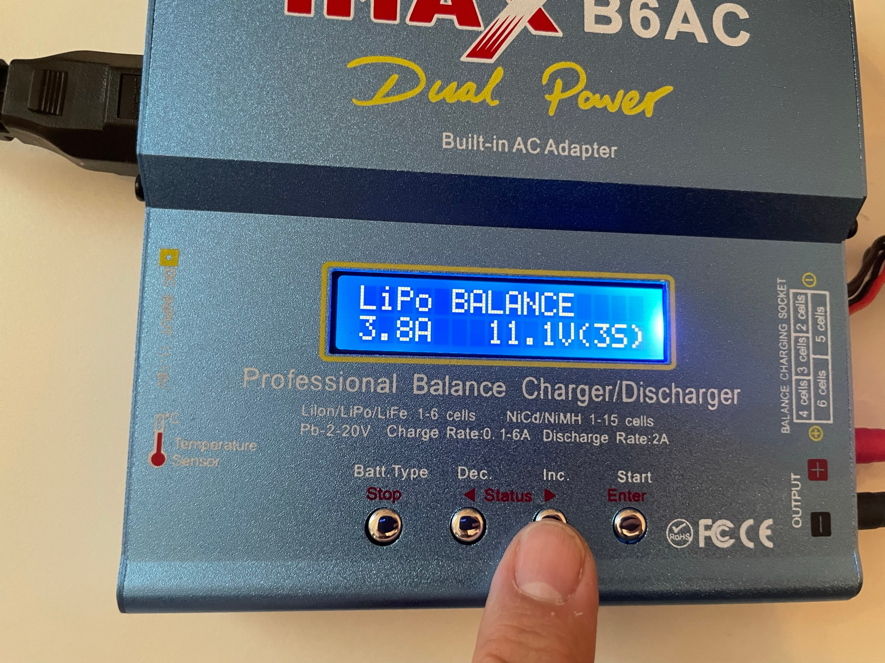
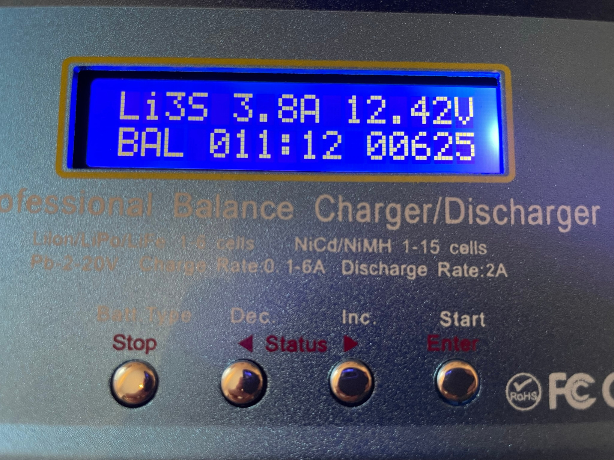
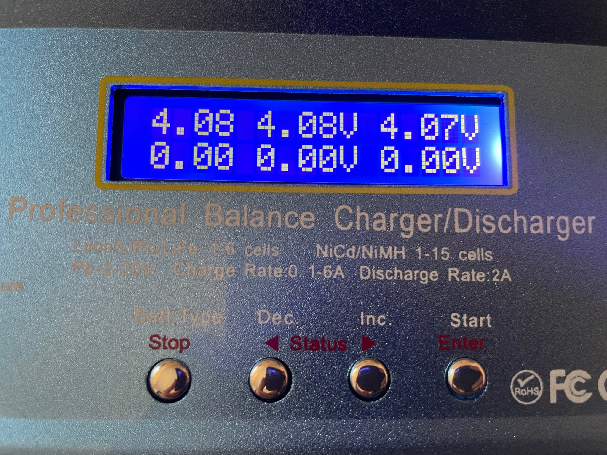

# WANGCL IMAX B6AC Lipo Battery charger B6 80W Digital LCD

Lipo Cargador 11-18V con adaptador para plomo ácido NI-CD/NI-MH 1-6S LI-PO

### Charging the battery

Balance charging the LiPo battery using the iMAX B6AC LiPo balance charger:

| Step | Image                           | Description                                                  |
| ---- | ------------------------------- | ------------------------------------------------------------ |
| 1    |  | Plug the charger to mains to power it up                     |
| 2    |  | Check that the jacks of the charging cable are correctly connected to the charger (black to negative and red to positive).  Connect the XT60 connector of the battery to the charging cable. |
| 3    |  | Insert the JST-XH balance connector of the battery to the designated slot in the balance charger (In our case 3 cells). |
| 4    |  | Use arrows to go to the **Balance Charge** setting.  Then Select **LiPo** battery type.  Confirm settings. For the 5000mAh 11.1V 50C LiPo battery: **Lipo**,  **3.8A** charging current (below 1C) and **11.1V (3S)** configuration. |
| 5    |  | Hold the **Start** button to start. Press it again to confirm. See [video](./assets/battery_start_charging.MP4) |
| 6    |  | During charging: use arrows to move to the screen with 6 voltages.  **Note:** It is normal to see the lower three indications static at 0.00. This is because the charger is capable of charging batteries with up to 6 cells, but our battery actually has only three. See [video](./assets/battery_while_charging.MP4) |
| 7    |                                 | The charger alarm will beep when charge is complete          |