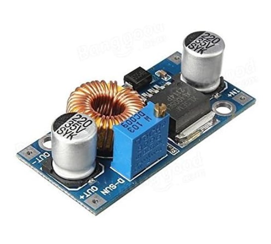

# Buck converter

ICQUANZX DC-DC

Voltage: 5-32V input  to 0.8-24V output

Intensity: Max peak 5A, Max. continuous use 3.5A.

Poer: Max power 75W, needs cooling above 50W

Dimensions: ‎11.5 x 7.5 x 2.3 cm

Weight: 30g