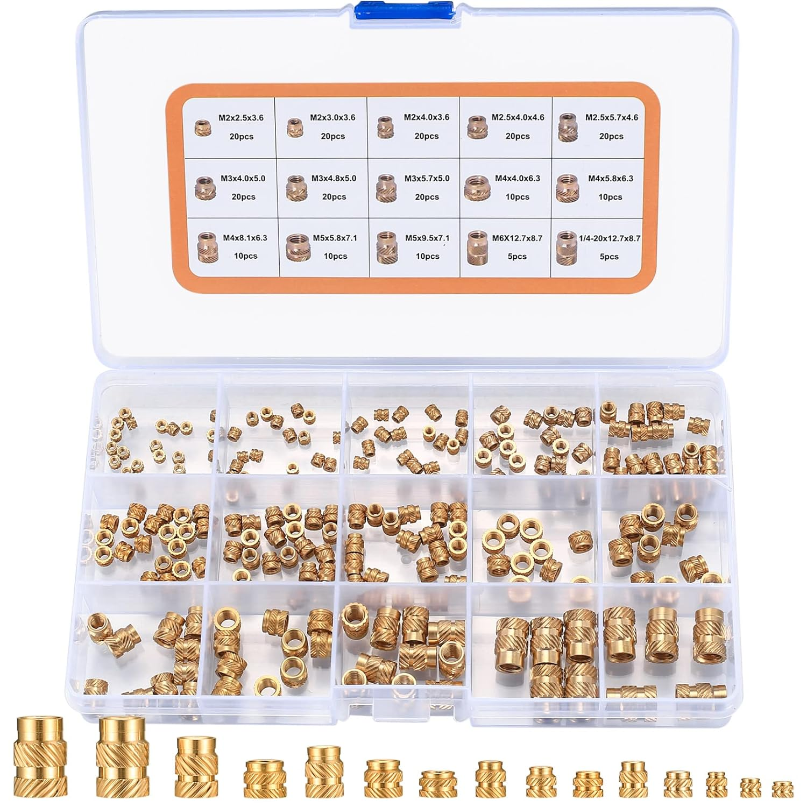

# Heat set inserts

Couldn't find a data sheet for the inserts I bought

Video tutorial: https://www.youtube.com/watch?v=P7nHyI1TwKY

* check the data sheets for maximum diameter and thickness
* insert them from the opposite side where you are going to screw 
* set the soldering iron 50-100C hotter than the nozzle temperature of the 3D printer
* keep soldering iron aligned with the insert 
* be patient, the slower it goes in, the better the bond
* remove iron when the insert is flush

