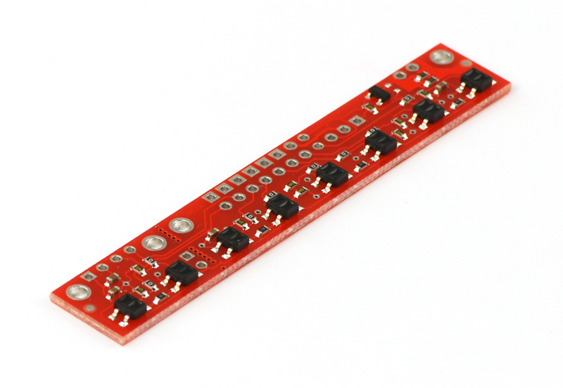

# Pololu QTR-8RC reflectance sensor array

https://www.pololu.com/product/961



Specs:

- Dimensions: 7.49 x 1.27 x 0.32 cm (without header pins installed)
- Operating voltage: 3.3-5.0 V
- Supply current: 100 mA
- 8 reflectance sensors mounted on a 9.525 mm pitch, 
- Output format: 8 digital I/O-compatible signals that can be read as a timed high pulse
- Optimal sensing distance: 3 mm
- Maximum recommended sensing distance: 9.5 mm
- Weight without header pins:3.09 g

Resources: https://www.pololu.com/product/961/resources

* Arduino library: https://github.com/pololu/qtr-sensors-arduino

* User guide: https://www.pololu.com/docs/0J12


## Tutorial

https://www.youtube.com/watch?v=akTegAQMoxo

Install QTRSensors library in the Arduino IDE

Tutorial with recommendations on how to solder the QTR sensor: https://www.youtube.com/watch?v=C2ZmbrH_bws

Tutorial on using the example from QTRSensors library to test the sensor:

https://www.youtube.com/watch?v=IsQXt-PJ8P0&list=PLqr8J8t_ccS1p8s-B9rlLctFWjpaDeBo1&index=9

```c++
#include <QTRSensors.h>

// This example is designed for use with eight RC QTR sensors. These
// reflectance sensors should be connected to digital pins 3 to 10. The
// sensors' emitter control pin (CTRL or LEDON) can optionally be connected to
// digital pin 2, or you can leave it disconnected and remove the call to
// setEmitterPin().
//
// The setup phase of this example calibrates the sensors for ten seconds and
// turns on the Arduino's LED (usually on pin 13) while calibration is going
// on. During this phase, you should expose each reflectance sensor to the
// lightest and darkest readings they will encounter. For example, if you are
// making a line follower, you should slide the sensors across the line during
// the calibration phase so that each sensor can get a reading of how dark the
// line is and how light the ground is.  Improper calibration will result in
// poor readings.
//
// The main loop of the example reads the calibrated sensor values and uses
// them to estimate the position of a line. You can test this by taping a piece
// of 3/4" black electrical tape to a piece of white paper and sliding the
// sensor across it. It prints the sensor values to the serial monitor as
// numbers from 0 (maximum reflectance) to 1000 (minimum reflectance) followed
// by the estimated location of the line as a number from 0 to 5000. 1000 means
// the line is directly under sensor 1, 2000 means directly under sensor 2,
// etc. 0 means the line is directly under sensor 0 or was last seen by sensor
// 0 before being lost. 5000 means the line is directly under sensor 5 or was
// last seen by sensor 5 before being lost.

QTRSensors qtr;

const uint8_t SensorCount = 8;
uint16_t sensorValues[SensorCount];

void setup()
{
  // configure the sensors
  qtr.setTypeRC();
  qtr.setSensorPins((const uint8_t[]){3, 4, 5, 6, 7, 8, 9, 10}, SensorCount);
  qtr.setEmitterPin(2);

  delay(500);
  pinMode(LED_BUILTIN, OUTPUT);
  digitalWrite(LED_BUILTIN, HIGH); // turn on Arduino's LED to indicate we are in calibration mode

  // 2.5 ms RC read timeout (default) * 10 reads per calibrate() call
  // = ~25 ms per calibrate() call.
  // Call calibrate() 400 times to make calibration take about 10 seconds.
  for (uint16_t i = 0; i < 400; i++)
  {
    qtr.calibrate();
  }
  digitalWrite(LED_BUILTIN, LOW); // turn off Arduino's LED to indicate we are through with calibration

  // print the calibration minimum values measured when emitters were on
  Serial.begin(9600);
  for (uint8_t i = 0; i < SensorCount; i++)
  {
    Serial.print(qtr.calibrationOn.minimum[i]);
    Serial.print(' ');
  }
  Serial.println();

  // print the calibration maximum values measured when emitters were on
  for (uint8_t i = 0; i < SensorCount; i++)
  {
    Serial.print(qtr.calibrationOn.maximum[i]);
    Serial.print(' ');
  }
  Serial.println();
  Serial.println();
  delay(1000);
}

void loop()
{
  // read calibrated sensor values and obtain a measure of the line position
  // from 0 to 5000 (for a white line, use readLineWhite() instead)
  uint16_t position = qtr.readLineBlack(sensorValues);
  
  double position_mm;
  char position_mm_char[10];
  
  // print the sensor values as numbers from 0 to 1000, where 0 means maximum
  // reflectance and 1000 means minimum reflectance, followed by the line
  // position
  for (uint8_t i = 0; i < SensorCount; i++)
  {
    Serial.print(sensorValues[i]);
    Serial.print('\t');
  }
  Serial.print(position);
  Serial.print('\t');
  
  position_mm = ((int)position - 3500)*9.525/1000;
  dtostrf(position_mm, 6, 2, position_mm_char);
  Serial.print("Error: ");
  Serial.print(position_mm_char);
  Serial.println(" mm");
  delay(250);
}
```

During calibration (about 10") move sensor to show full range (e.g. black line and white background). Beware of shades!. LED 13 will turn off when calibration is complete. In serial monitor you can see output: 

 

```
96 96 96 100 96 96 96 100 
2500 2500 2500 2500 2500 2500 2500 2500 

23	23	0	0	0	23	44	855		7000	Error:  33.34 mm
3	3	24	45	46	362	572	180		5836	Error:  22.25 mm
3	3	24	23	24	362	362	135		5735	Error:  21.29 mm
1	1	23	21	66	249	44	180		5593	Error:  19.94 mm
3	3	24	23	296	227	24	180		5091	Error:  15.15 mm
1	1	1	0	249	159	24	248		5376	Error:  17.87 mm
23	1	1	21	207	1	23	160		5307	Error:  17.21 mm
21	0	0	110	204	0	21	110		4518	Error:   9.70 mm
21	21	0	273	202	0	21	86		3973	Error:   4.51 mm
21	21	21	341	226	1	21	88		3882	Error:   3.64 mm
21	21	21	321	44	0	21	88		3860	Error:   3.43 mm
21	21	66	271	21	0	43	86		3657	Error:   1.50 mm
19	19	362	290	19	19	64	108		3317	Error:  -1.74 mm
43	21	366	110	21	21	43	63		2788	Error:  -6.78 mm
21	89	299	20	0	21	43	20		1770	Error: -16.48 mm
23	412	321	21	0	0	23	0		1437	Error: -19.65 mm
46	252	0	0	0	0	0	0		1000	Error: -23.81 mm
254	48	0	0	0	21	21	20		0		Error: -33.34 mm
209	0	0	0	0	23	23	0		0		Error: -33.34 mm
434	43	21	41	43	89	89	111		2428	Error: -10.21 mm
316	224	21	41	64	88	111	131		2679	Error:  -7.82 mm
23	294	66	41	43	88	109	155		3658	Error:   1.50 mm
23	178	271	43	44	88	111	155		3625	Error:   1.19 mm
219	151	287	218	19	41	41	83		2045	Error: -13.86 mm
21	111	43	273	0	21	21	41		2421	Error: -10.28 mm
66	109	267	613	292	1	1	21		2709	Error:  -7.53 mm
0	0	0	0	252	23	23	21		4000	Error:   4.76 mm
64	21	86	196	637	312	21	0		3759	Error:   2.47 mm
64	0	43	108	133	480	21	0		4147	Error:   6.16 mm
64	0	21	41	88	685	386	20		4982	Error:  14.12 mm
43	0	0	20	66	455	364	20		5336	Error:  17.49 mm
43	0	0	20	43	43	346	20		6000	Error:  23.81 mm
43	0	0	20	64	88	1000406		6121	Error:  24.97 mm
21	0	0	0	21	111	703	1000	6490	Error:  28.48 mm
21	21	21	20	0	0	21	251		7000	Error:  33.34 mm
...
```

Another tutorial: https://www.instructables.com/PID-Based-Line-Following-Robot-With-POLALU-QTR-8RC/

A great video on PID: https://www.youtube.com/watch?v=4Y7zG48uHRo
