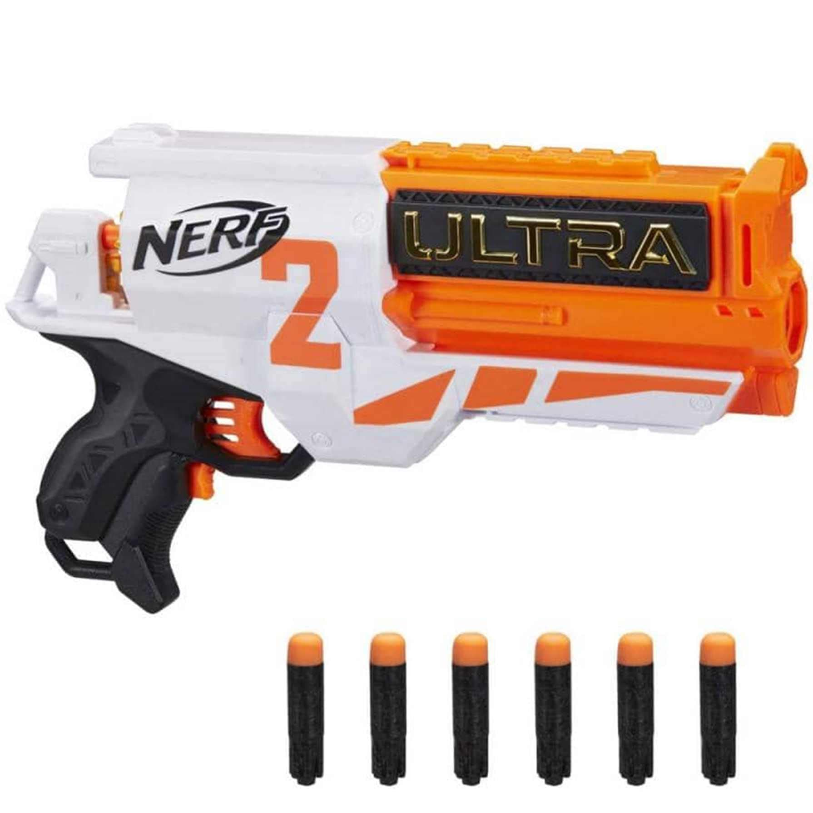

# Nerf

Inspiration from:

* https://www.youtube.com/watch?v=4pb9OxdDGfk
* https://www.instructables.com/How-to-Make-a-Human-Seeking-Nerf-Auto-Turret-Robot/
* DIY Autonomous Nerf Turret: https://www.youtube.com/watch?v=Xz5ZvW98HRs
* How to Make a Raspberry Pi Motion Tracking Airsoft / Nerf Turret: https://www.youtube.com/watch?v=HoRPWUl_sF8&t=1327s
* You Can't Hide from the Face Tracking Nerf with AI: https://www.youtube.com/watch?v=bPh1TztVlwk

We rushed in to buying the Commander, then realised loading the spring automatically would probably require an expensive linear actuator of the kind used for garage doors, and the sequence would be difficult to implement, heavy and impractical.

Then we did a proper review of the options and the Stryfe appears to be the best candidate, followed by the Ultra 2.

 

| Image                            | Model                         | Hasbro Ref. | Dimensions           | Weight                                                       | Price  | Comments                                                     |
| -------------------------------- | ----------------------------- | ----------- | -------------------- | ------------------------------------------------------------ | ------ | ------------------------------------------------------------ |
|  | Nerf Elite 2.0 Commander RD-6 | E9485EU5    | 6.7 x 36.2 x 24.1 cm | 560g                                                         | 9.99€  | Reloading with the black slider while keeping the trigger pressed allows rapid fire. However the slider has ~60cm stroke and the spring requires a lot of force. |
|    | Nerf Ultra 2                  | E79214R00   | 7.9 x 36.8 x 24.1 cm | 490g (probably not including batteries) 6 AA batteries ~140g | 34.98€ | Easier to automate: keep lower trigger pressed continuously and actuate the top one with a 12V standard car door actuator. However there are bad reviews due to inaccurate Ultra darts and frequent clogging. |
|     | Nerf Modulus Stryfe           | C3583F03    | 7.3 x 25.7 x 42.2 cm | 930g (?? Possibly including attachments) 4 AA batteries ~100g | 42.07€ | Easy to automate, same as the Ultra 2. Pricier but has better reviews. Heavier? Check dimensions... |

