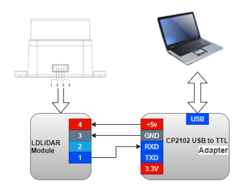

# LetsOKdo LiDAR HAT for Raspberry Pi kit

cfr this [Getting started guide](./assets/A700000007824693.pdf), downloaded from [here](https://www.pi-shop.ch/lidar-ld06-lidar-module-with-bracket-entwicklungskit-fuer-raspberry-pi-sbc) 

The kit comes with cables for GPIO header pins and a ROS 1 driver: https://github.com/LetsOKdo/ld19

I bought this [CP2102 USB to TTL adapter](https://www.amazon.es/gp/product/B07N2YLH26/) and connected it iaw the following diagram (source is this [LD19_Development_Manual V2.3](./assets/LD19_Development Manual_V2.3.pdf), downloaded from [here](https://www.elecrow.com/download/product/SLD06360F/LD19_Development%2520Manual_V2.3.pdf) ).

| CP2102 USB to TTL adapter | LD06 LiDAR (#1-4 from left to right) |
| ------------------------- | ------------------------------------ |
| 3V3                       |                                      |
| TXD                       |                                      |
| RXD                       | #1 (white)                           |
| GND                       | #3 (red)                             |
| +5V                       | #4 (blue)                            |

Note: yellow cable #2  (PWM?) is not connected

More info on this [LDROBOT_LD06_Datasheet](./assets/LDROBOT_LD06_Datasheet.pdf), downloaded from [here](https://www.inno-maker.com/product/lidar-ld06/)

## ROS2 driver

I used the same driver I had for manolobot and it worked, cfr [instructions in the repo](https://github.com/mhered/manolobot/blob/main/BOM/LD06-lidar.md)

In RVIZ (found by trial and error, not endorsed): 

- Fixed Frame: base_laser
- Add LaserScan
- Topic: /scan

### Other ROS2 drivers for LD06/19 available on Github

* [Myzhar/ldrobot-lidar-ros2](https://github.com/Myzhar/ldrobot-lidar-ros2)

* [linorobot/ldlidar](https://github.com/linorobot/ldlidar/tree/ros2) - an attempt to fix and improve the driver provided by LDRobots in their [website](https://www.ldrobot.com/download/44)

* [ldrobotSensorTeam/ldlidar_ros2](https://github.com/ldrobotSensorTeam/ldlidar_ros2)
