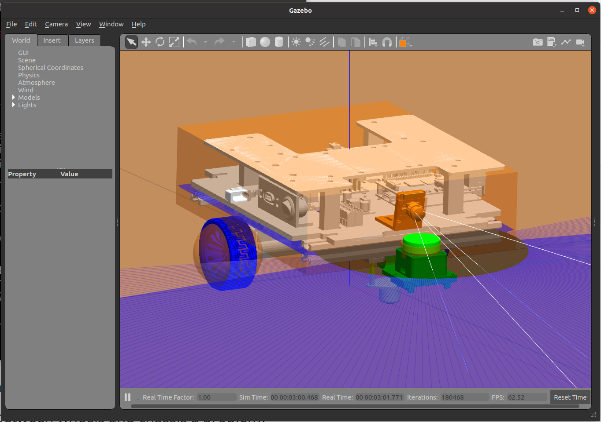
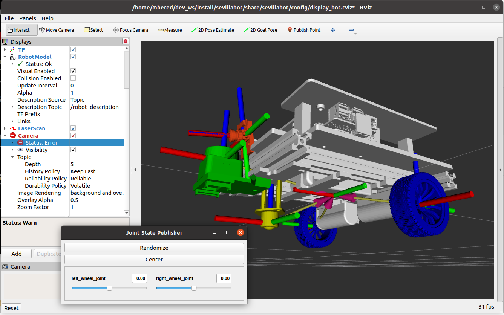

# Simulation

## Quick start

1. Spawn the robot


```bash
$ cd ~/dev_ws/
$ source install/setup.bash
$ ros2 launch sevillabot rsp.launch.py use_sim_time:=true
```

2. Launch gazebo

```bash
$ cd ~/dev_ws/
$ source install/setup.bash
$ ros2 launch sevillabot launch_sim.launch.py
```



3. Display in RVIZ

```bash
$ cd ~/dev_ws/
$ source install/setup.bash
$ ros2 launch sevillabot display.launch.py
```



4. Teleop with keyboard

```bash
$ cd ~/dev_ws/
$ source install/setup.bash
$ ros2 run teleop_twist_keyboard teleop_twist_keyboard
```

or,  Teleop with gamepad (plugged to PC)

```bash
$ cd ~/dev_ws/
$ source install/setup.bash
$ ros2 launch sevillabot joystick.launch.py
```

## Exporting a FreeCAD assembly to STL

Issue: Body placement is not respected when exporting an assembly as STL.
Workaround (see https://github.com/FreeCAD/FreeCAD/issues/12278):

1. Move all the items you want to export to a Part
2. Go to the Mesh Workbench
3. Create a Mesh from the Part
4. Export those meshes as STL

To maintain local origin, copy the Part to root axes then export this copy of the part.

Issue: cannot export to DAE format (missing pycollada error message)

## Adding a mesh to URDF

Place meshes in `meshes` folder, modify to `CMakeLists.txt` to install this directory 

Use `filename="file://$(find sevillabot)/..."` for path

Note: need to scale when importing (FreeCAD units are mm, Gazebo units are m)

```xml
<mesh filename="file://$(find sevillabot)/meshes/ASSY_sevillabot_base.stl" scale="1.0e-3 1.0e-3 1.0e-3"/>
```

## Fine tuning

* In `properties.xacro` fix `W_z` (wheel axis z-offset in m) = 0.02 (not 0.025, otherwise wheels are out of their axes!) Checked it matches FreeCAD reference frame displacement.
* modified `launch_sim.launch.py`to load `sevillabot_world.world` as default world for gazebo simulation
* Added default RVIZ config `display_bot.rviz`
* In `camera.xacro` modify horizontal FOV to 160 degrees. Since camera is small, remove <collision> and <inertial> tags. 
* Update `Camera.md` with camera properties
* in `Simulation.md` add notes for teleop with joystick and all changes above

## To Do

- [x] add wheels mesh
- [x] add caster mesh
- [x] align height of caster
- [x] measure and correct position of wheels
- [x] is collision between wheels and chassis a problem? Apparently not
- [x] adjust angle of lidar
- [ ] measure values of CoGs, masses, inertias and update in URDF
