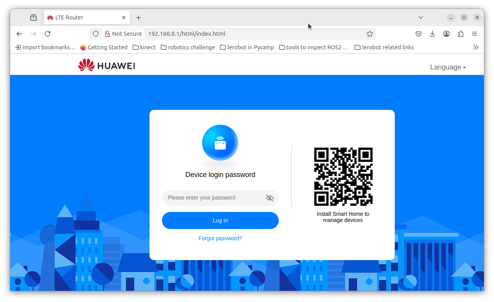
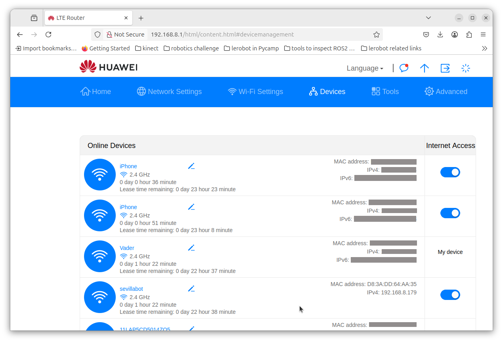

# Troubleshooting

## Issue: bot suddenly stops connecting to host

Happened just at the end of Pi Wars 2024. 

Apparently  for some reason a different IP address was assigned to the Raspberry Pi

To Fix:

1. Connect to RPi with a screen and keyboard, Open a terminal
2. Identify new IP address with:

```bash
$ ip address
...
3: wlan0: 
	...
    inet 192.168.8.179/24 brd ...
...
```

So it is now `192.168.8.179` (it used to be `192.168.8.170`)

4. In the host computer edit `.ssh/config` to replace old IP with new IP

```bash
$ sudo nano .ssh/config
# Read more about SSH config files: https://linux.die.net/man/5/ssh_config
  Host sevillabot
    HostName 192.168.8.179
    User mhered
...
```

5. Try to connect, it will complain that you are renaming a known host, and ask you to remove the old key:

```bash
$ ssh mhered@sevillabot
@@@@@@@@@@@@@@@@@@@@@@@@@@@@@@@@@@@@@@@@@@@@@@@@@@@@@@@@@@@
@    WARNING: REMOTE HOST IDENTIFICATION HAS CHANGED!     @
@@@@@@@@@@@@@@@@@@@@@@@@@@@@@@@@@@@@@@@@@@@@@@@@@@@@@@@@@@@
IT IS POSSIBLE THAT SOMEONE IS DOING SOMETHING NASTY!
Someone could be eavesdropping on you right now (man-in-the-middle attack)!
It is also possible that a host key has just been changed.
The fingerprint for the ECDSA key sent by the remote host is
SHA256:***************************************
Please contact your system administrator.
Add correct host key in /home/mhered/.ssh/known_hosts to get rid of this message.
Offending ECDSA key in /home/mhered/.ssh/known_hosts:6
  remove with:
  ssh-keygen -f "/home/mhered/.ssh/known_hosts" -R "192.168.8.179"
ECDSA host key for 192.168.8.179 has changed and you have requested strict checking.
Host key verification failed.

$ ssh-keygen -f "/home/mhered/.ssh/known_hosts" -R "192.168.8.179"
# Host 192.168.8.179 found: line 6
/home/mhered/.ssh/known_hosts updated.
Original contents retained as /home/mhered/.ssh/known_hosts.old
```

## Scanning for the IP address of `sevillabot`

Easier than connecting the robot to keyboard and screen, assumes MAC address of RPi has not changed (should not unless RPi was replaced or intentionally hacked).

Execute script:

```bash
$ python3 ./commands/find_lost_robot.py
Scanning network for sevillabot...
[sudo] password for mhered: 
✅ Found sevillabot at IP: 192.168.8.179
```

Note `arp` is a dependency of this python script, may need to install it with:

```bash
$ sudo apt install arp-scan
```

## Checking IP addres of robot

Another way is to go to the router:


Go to **Devices** and search for the robot by name or MAC, note down its IP address.


