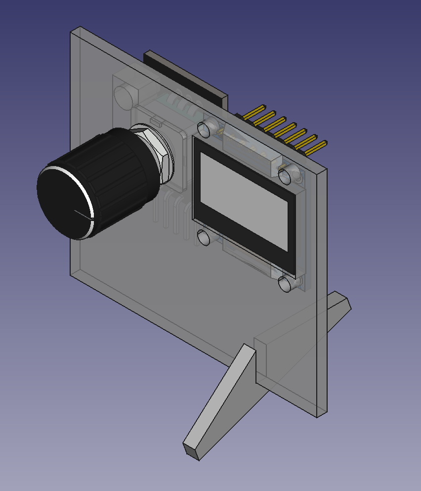
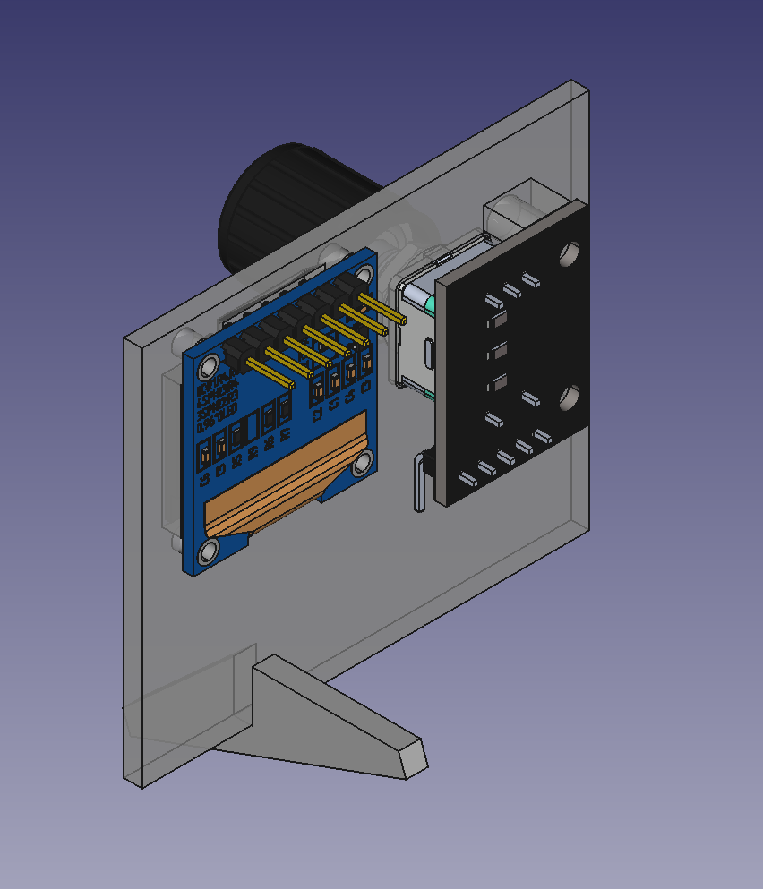
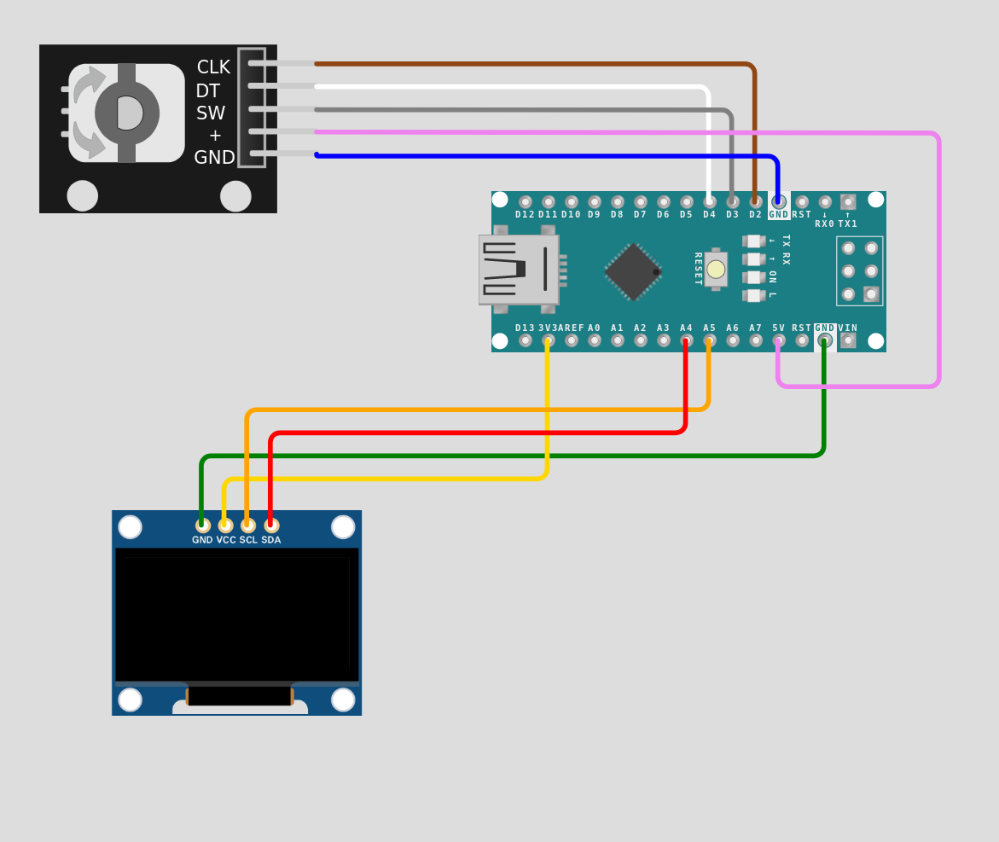
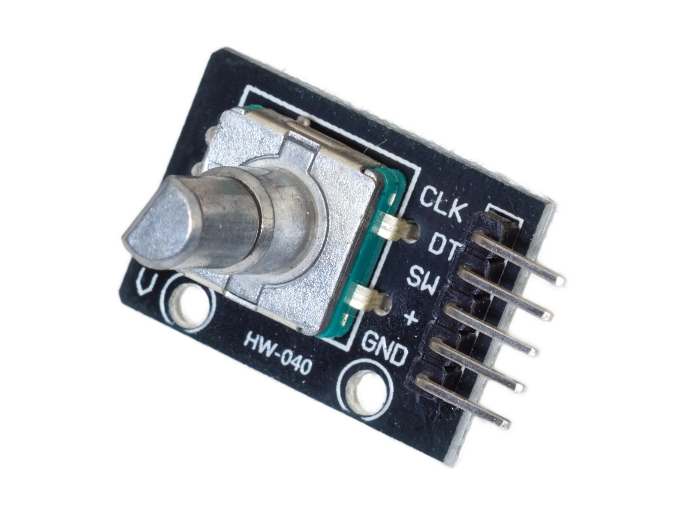
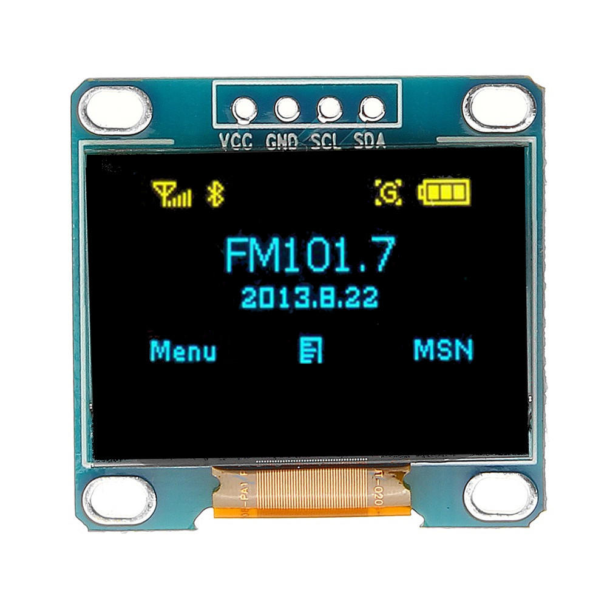
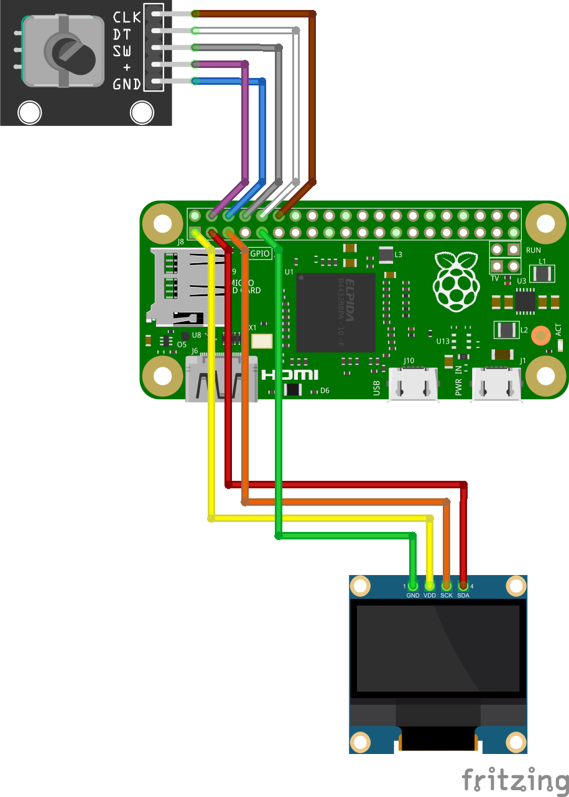
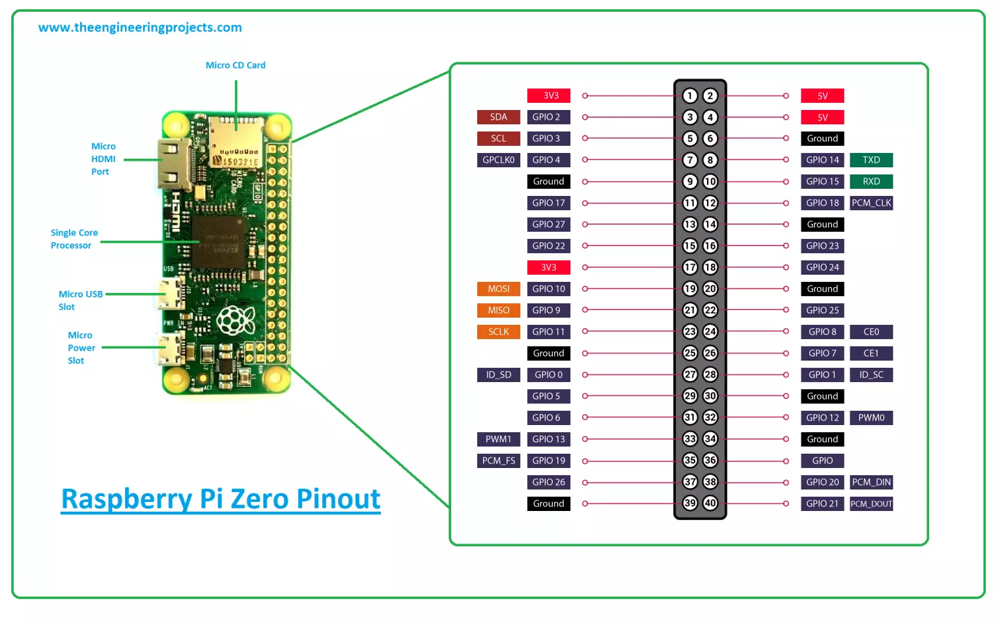

# README.md

Miniproject to create a minimal interface aboard the robot.

Components:

* KY40 rotary encoder with switch
* SS1306 0.96" OLED display screen
* 3D printed parts

## 3D printed parts





I downloaded CAD files of the components to aid the design, then fine tuned with physical measurements. Notes about the downloaded CAD files:

- `rotary-encoder-with-knop-1.snapshot.1`: downloaded as SLDPRT, converted to STEP using OnShape, OK!
- `oled-0-96-display-1.snapshot.1`: downloaded as STEP and OK(-ish, dimensions are a bit off and 6 pins instead of 4)
- `ky-040-rotary-encoder-1.snapshot.1`: downloaded as SLDPRT, converted to STL in AnyConv: KO, wrong scale!!
- `display-oled-ssd1306-de-0-96-1.snapshot.6`: downloaded as STEP but KO, dimensions not fitting part

Note: Some options for converting SLDPRT for free without SolidWorks:

* [AnyConv](https://anyconv.com/) but rather unreliable: scale not respected, or failure to convert 
* [ConvertCADFiles](https://convertcadfiles.com/): one free trial, afterwards pay per conversion
* Create account in [OnShape](https://cad.onshape.com/) (with SPAM user), open file then export as STL or STEP
* Not tested: [download eDrawing](https://www.solidworks.com/support/free-downloads) (for Windows)

## Arduino

### Wiring





| KY-40 pin | Cable  | Arduino pin |
| --------- | ------ | ----------- |
| GND       | blue   | GND         |
| +         | purple | 5V          |
| SW        | grey   | D3          |
| DT        | white  | D4          |
| CLK       | brown  | D2          |



| OLED pin | Cable  | Arduino pin |
| -------- | ------ | ----------- |
| GND      | green  | GND         |
| VCC      | yellow | 3V3         |
| SCL      | orange | A5 / SCL    |
| SDA      | red    | A4 / SDA    |


### Programming

#### Sources

* Inspired on the [video tutorial by upir ](https://www.youtube.com/watch?v=HVHVkKt-ldc) and [companion code](https://github.com/upiir/arduino_oled_menu/tree/main) for a beautiful menu design with icons for the OLED display. Note this code controls the menu using 3 push buttons. 

* I used ideas from this [video tutorial by LaBuhardillaDelLoco](https://youtu.be/cWgWvNhWg-A) and the [GFX library documentation](https://learn.adafruit.com/adafruit-gfx-graphics-library?view=all) to migrate to the Adafruit GFX and SSD1306 libraries for the OLED display,  instead of `u8g` (it was not working, although in hindsight it was probably due to wiring errors)

* Used ideas from this [video tutorial by Yvan from brainy-bits](https://www.youtube.com/watch?v=cYCTMdUi8P0 ) and its [companion blog post with code](https://www.brainy-bits.com/post/best-code-to-use-with-a-ky-040-rotary-encoder-let-s-find-out) on how to control a rotary encoder (with debouncing) to use it as input method
* Another [simpler menu with rotary encoder tutorial](https://www.youtube.com/watch?v=vHRyj3e3ZTU), which I didn't really use

* Created my own graphics online: used [Pixilart](https://www.pixilart.com/) which is super simple instead of [Photopea](https://www.photopea.com/) which is way more complex

* Convert images into C code arrays using online tool [image2cpp](http://javl.github.io/image2cpp/) 

* Test the sketch online using [WOKWI online emulator](https://wokwi.com/projects/397015999090347009) although it was not very practical with the OLED, had a tendency to trigger unexplained build errors when tweaking the appearance.

### Arduino sketch

Notes:

* Modified the Encoder code so it only registers clockwise or counterclockwise input when a full notch is moved (i.e. the knob fall in a stable position). Original code counted also halfway movements. 
* Encapsulated the code to control the encoder in a custom `Encoder` class. To include a class in arduino: add `#include "src/Encoder.h"` and put `Encoder.h` and `Encoder.cpp` files in a `/src/` subfolder below the location of the main `.ino` file, see [here](https://forum.arduino.cc/t/how-do-i-include-a-library-in-a-sketch-directory/1079812)
* I simplified a lot the code for the menu

### Issues / To Do

- [ ] The debouncing should not work because the wait time is almost 0! It was working when the only action is to print the command via serial (e.g. see `rotary_encoder_control_class.ino`)
- [ ] When the menu code is added to the mix, it fails sometimes to detect accurately the Encoder input, and behaves a bit erratically (e.g does not react or moves to the wrong selection ). Why?

- [ ] Encapsulate menu in a class

## Raspberry pi

Next step translate to use directly with RPi

See e.g. [this tutorial by Computadores y Sensores](https://www.youtube.com/watch?v=n0dHQSTSilM) which uses raspiOS, python and LUMA library. There are plenty of interesting examples reading info from the RPi system (e.g. date and time, network usage, temperature? )

#### Wiring






| KY-40 pin | Cable  | RPi pin      |
| --------- | ------ | ------------ |
| GND       | blue   | GND / #6     |
| +         | purple | 5V / #4      |
| SW        | grey   | GPIO14 / #8  |
| DT        | white  | GPIO15 / #10 |
| CLK       | brown  | GPIO18 / #12 |


| OLED pin | Cable  | RPi pin           |
| -------- | ------ | ----------------- |
| GND      | green  | GND / #9          |
| VCC      | yellow | 3V3 / #1          |
| SCL      | orange | GPIO 3 / SCL / #5 |
| SDA      | red    | GPIO 2 / SDA / #3 |

### Setup

I2C requires activation in Raspi, see this discussion: https://askubuntu.com/questions/1273700/enable-spi-and-i2c-on-ubuntu-20-04-raspberry-piNo but there is no need in ubuntu.

Install i2c-tools and check I2C devices are detected: 

```bash
sudo apt install i2c-tools
i2cdetect -y 1
     0  1  2  3  4  5  6  7  8  9  a  b  c  d  e  f
00:          03 -- -- -- -- -- -- -- -- -- -- -- -- 
10: -- -- -- -- -- -- -- -- -- -- -- -- -- -- -- -- 
20: -- -- -- -- -- -- -- -- -- -- -- -- -- -- -- -- 
30: -- -- -- -- -- -- -- -- -- -- -- -- -- -- -- -- 
40: -- -- -- -- -- -- -- -- -- -- -- -- -- -- -- -- 
50: -- -- -- -- -- -- -- -- -- -- -- -- -- -- -- -- 
60: -- -- -- -- -- -- -- -- -- -- -- -- -- -- -- -- 
70: -- -- -- -- -- -- -- --      
```

Install dependencies:

```bash
sudo apt-get install python3-dev python3-rpi.gpio
sudo apt install python3-pip
sudo pip3 install adafruit-circuitpython-ssd1306
```

Create a sample program

```python
from board import SCL, SDA
import busio
import adafruit_ssd1306

i2c =busio.I2C(SCL, SDA)

# create calss and define screen size

display = adafruit_ssd1306.SSD1306_I2C(128, 64, i2c)

#clear screeeb

display.fill(0)
display.show()

# define 1 pixel at the origin 0,0
display.pixel(0,0,1)

# define 1 pixel at center point
display.pixel(64,32,1)

# define 1 pixel at the opposite corner
display.pixel(127,63,1)

display.show()
```

It works!

#### Programming

#### Issues / To Do

- [ ] ssh onto the zero via USB: see this tutorial https://johnnymatthews.dev/blog/2021-02-06-connect-to-raspberry-pi-zero-over-usb-on-ubuntu/
