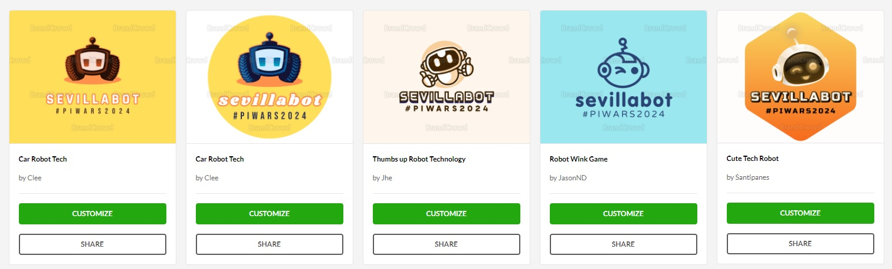
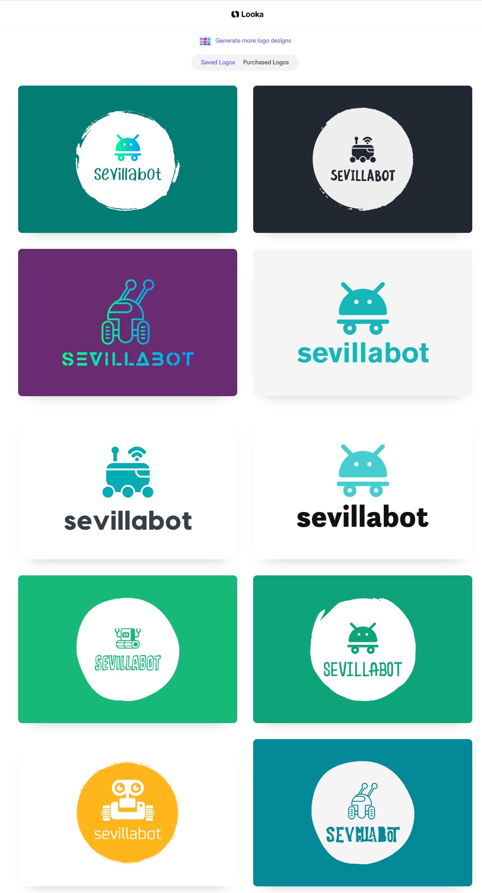
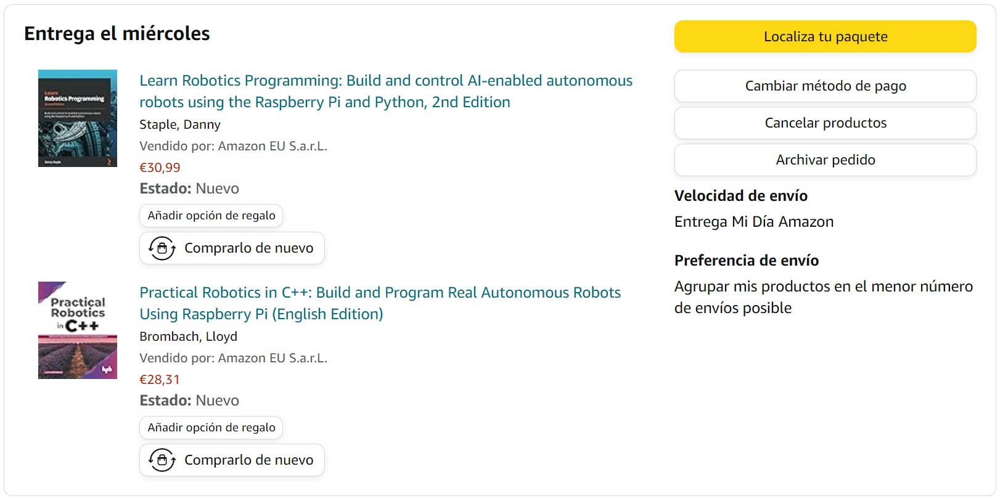
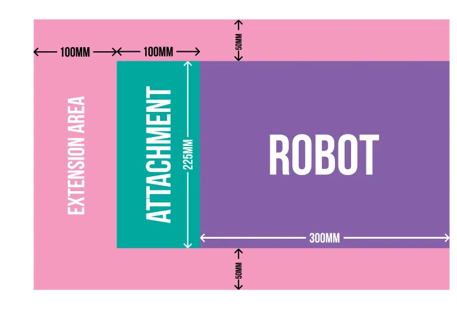

# Made a blog in BlueHost

see secrets.md in local

# Made some logos

BrandCrowd (spam.mhered): https://www.brandcrowd.com/maker/shortlist/718945c4-b511-4b5e-aa74-6c4dfafddd57?utm_medium=email&utm_source=template-sendgrid&utm_campaign=shortlist-saved&utm_content=shortlist-saved-confirmation&utm_term=review-shortlist-button

Looka.com: seems I didn't sign up and got assigned user: looka-ref-user-name-4GAHPhyn9S. Difficult to change the logo (need to scroll endlessly) 

Temporary logo I chose for the blog:

# Ordered some items

* Practical Robotics in C++ by Lloyd Brombach

* Learn Robotics Programming 2nd Ed by Danny Staple
* A Raspberry Pi 5
* 2x microUSB flat cables from Aliexpress (with a second account that uses Apple OAuth)
* Motors (x4), battery (x2), Arduino Nano (x3), and Buck converter (x3) all of them with some spares, from Amazon.

# Gathered references

Robofoundry resources: https://robofoundry.medium.com/

Checked out Simon robot: 

* https://esimonsite.com/proyectos/mini_robot/
* STEP file: https://github.com/simonllopez/mini_robot_hw/blob/c72156409fd8e69483608780fe5bce98770d15b5/Ensamblaje_Base_2023.step

# Notes on #piwars

38 Adults & Mixed teams will compete on 21st April in 3 categories: Beginner, Intermediate and Professional. **sevillabot** will compete in the category Beginner.

We make three commitments: 

- to build a robot to compete on the appropriate competition day.
- to provide regular updates, when requested, to assure that we are on track to complete our robot build and testing by the competition date. The organization will be setting deadlines for replies to ensure that spaces are not wasted, so **it is vital to respond to update requests** .
- to respond to (or acknowledge) all communications in a timely manner.

There is a fee of 20 GBP per team.

All teams must send at least one participant to the physical event in Cambridge. The maximum recommended team size is 10 people. The organization will ask how many members are actually attending to assign a suitable workroom onsite. All teams must have or be accompanied by a responsible adult. 

# Safety rules 

* In the workrooms all robots must remain powered down or ‘on blocks’ to prevent any remote control conflicts or autonomous mistakes may cause damage.
* Robots must not (intentionally) emit smoke or flames.
* No soldering within the building. Soldering is acceptable outside the building with a **battery-powered soldering iron**, taking care that no smoke enters the building and triggers the smoke detectors. 

# Robot rules

## One single robot

We are permitted to enter **one single robot** to the competition. This robot must handle all of the challenges. We are not permitted to *swap out* the entire robot at any time. It may have attachments, and we are permitted to exchange *parts* of our robot to compete in the different challenges (e.g. motors and wheels) but it must remain fundamentally the *same* robot: When adding attachments, the basic chassis, Raspberry Pi and controller arrangement must remain the same.

## With an official Raspberry Pi at the Core

We may use multiple Pis (Pi, Zero, Pico) and other boards (e.g. Arduinos, micro:bits, even non-official RP2040-derived boards, or other) BUT **an official Raspberry Pi board must be in overall/central control of your robot as the primary/core processor**. 

Additional pieces of equipment e.g. a games controller, a laptop, mobile phone or tablet may be used to control the robot, but **must not be physically attached when competing on the courses**.

## Battery-powered

All robots must be powered by batteries and must operate without being tethered to a static mains electricity power source.

Mains power may be used for recharging battery packs.

If LiPo batteries are used, **any charging must supervised and be done inside a fire-proof bag or box**

## Only some configurations are allowed

No airborne robots are permitted, e.g. drones.

Walking and self-balancing robots are permitted.

Hovercraft-style robots are allowed *provided that any fans are enclosed safely*.

## And robot dimensions are constrained

### Main chassis

The main chassis (including wheels and any protrusions that form part of the main robot) of competing robots must fit within a 225mm width x 300mm length x 370mm height box (purple area)

### Attachments

Attachments may be added to the robot for specific challenges. Any attachment can add additional length of 100mm and height of 80mm (as in the green area in the diagram above) such that, when the attachment is at rest there is no additional width, maximum length must be no more than 400mm, the maximum height must be no more than 450mm.

An attachment may be *animated* in some way such that it extends beyond the boundaries above into the “extension area”. However, the attachment must stay within a box 325mm wide by 500mm length (this is shown as the pink area above).

## Our thoughts

The basic architecture of our current robot is in line with the rules, but we need to think about changing the chassis because the wheels are too wide apart and the camera protrudes too much at the front (although the camera could pass as an attachment maybe?).

Will need to adapt the dimensions of the current robot: 34cm long (ko by 4cm, would need to move front camera) x 27 cm wide (ko by 5.5cm, could fix moving wheels inwards because bottom width is 14cm and wheel width is 3cm, leaves 1cm clearance in each side and some to spare) x 24 cm high (ok)

Other changes: 

* should remove large screen (heavy and hungry)
* Castor wheels are not recommended. Consider 4WD mecanum? How to program mecanum wheels: https://www.youtube.com/watch?v=gnSW2QpkGXQ

# The Challenges

Each challenge can earn points that contribute to an overall score. None are mandatory but no points can be earned from challenges not entered.

## [Lava Palava](https://piwars.org/2024-disaster-zone/challenges/lava-palava/) - Escape the volcanic eruption

This challenge is autonomous-only: the Raspberry Pi will control the robot by itself for the entire duration of the challenge without interference from the operator, except for a button press to initiate movement and another, if necessary, to stop movement.

This will require a line-following algorithm. I think there are specific line-detection sensors, otherwise I could use a camera. Potentially I could use a Lidar to stay away from the walls.

## [Eco-Disaster](https://piwars.org/2024-disaster-zone/challenges/eco-disaster/)- Sort the barrels of toxic waste!

### Challenge description

This challenge can be driven autonomously *or* by remote control. The points available are weighted so autonomous robots can earn more points.

### Our thoughts

## [Escape Route](https://piwars.org/2024-disaster-zone/challenges/escape-route/) - Navigate the blind maze to find your way out!

### Challenge description

The arena for the maze is made of a by a 2m by 3m area surrounded by a 119mm high walls, all painted in matte black. There are 3 colored blocks (red, green, blue) are placed as obstacles in any one of six predefined configurations, unknown in advance.

There are three ways to compete in this challenge (The points available are weighted so autonomous robots can earn more points):

* **Fully autonomous**: The team has 1' to calibrate the vision system then can only press start and stop.
* **Blind remote control**: Teleoperated via sensora on the robot and a screen for the driver.
* **Call and response**: With a team looking at the maze and giving instructions to a driver who cannot see the maze

### Our thoughts

I am thinking going for blind remote control if I can position the lidar below 119mm. For this one I need to build a replica of the maze and practice a lot!

## [Minesweeper](https://piwars.org/2024-disaster-zone/challenges/minesweeper/) -  Find and defuse the bombs!

### Challenge description

Arena: 1.6 by 1.6m area surrounded by 30cm tall black walls. The floor is made of 4x4 squares of white opaque perspex.

A single, random square will be lit up in red. The robot must visit the  square in question and stop, motionless for 1 second with some part of  the robot over the square. The light goes off and another random tile lights up up to 20 times.

Autonomous teams will have 1' to calibrate the vision system.

This challenge can be driven autonomously or by remote control. The points available are weighted so autonomous robots can earn more points.

### Our thoughts

I can imagine some vision system based on a top mounted camera, then a routine that turns the robot until the light is in front of the robot, then moves towards it, stops when it is on top of it, then waits 1", then repeats when a .

Mocking somewhere to test to fine tune (field of view, detecting light, when to stop etc) may be difficult though. I think we may compete here with remote control.

11/12 - check out this very nice blog:https://eastdevonpirates.blogspot.com/2023/12/minesweeper-piwars-2024.html with a discussion.

Found 30cm 130 degree convex mirrors in Amazon for 30€. Made some calculations and with a picamera (75degrees angle of view) placed at 10cm from the floor looking upwards, the convex mirror placed 20cm above the camera facing downwards I could monitor a circle 154cm in diameter. But the mirror weighs 1kg...

## [The Zombie Apocalypse](https://piwars.org/2024-disaster-zone/challenges/zombies/) - Shoot the undead!

### Challenge description

The robot is placed 1- 1.5m away from a tower with 3 levels: ground, middle and top floor up to 60cm above ground. The aim is to hit card-sized targets (62mm by 88mm) using balls or Nerf projectiles.

This challenge can be driven autonomously *or* by remote control. The points available are weighted so autonomous robots can earn more points.

However, as there uncertainty about the exact distance and the geometry of the tower, we don't know really how to identify the targets automatically. By color? Some specific design? Generally, we have questions about this challenge. What are targets in the "compound"? 

### Our thoughts

Today (19/10) I bought a [laser pointer]() and a [Nerf](). I am thinking about attaching the nerf and adding some servos to aim up and down, pull the trigger of the Nerf and reload it. Also I could imagine some way of auto aiming by detecting the laser with a camera, but I don't really know how to choose the target automatically.

11/12 - check out new information released in the discord and the official website with details of the arena and the design of the zombies

## [Pi Noon - The Hindenburg Disaster](https://piwars.org/2024-disaster-zone/challenges/pi-noon/) - Defend your balloon from an explosive end!

One (or more) members of the team will control the robot via wireless controller(s). This challenge *could* be tackled autonomously for the laughs, without extra points.

## [The Temple of Doom](https://piwars.org/2024-disaster-zone/challenges/temple-of-doom/) - Go on an adventure and tackle the obstacles in your way!

This is a remote-controlled challenge to test the agility of our robot and our driving skills. The obstacle course will only be revealed on the day of the competition, so it is important to watch the competition on Saturday. 

Not a lot of information, we just know that the course contains "several fiendish traps, snags and puzzles", and some recommendations from the organization of robot features that may help: 

* low center of gravity
* good ground clearance
* good grip
* power to drive up slopes

All obstacles **must** be *attempted* first, then we may skip them (but no points for skipped obstacles). We have up to **three attemps** at the challenge within the 5' time limit.

### Ideas to improve grip

* Add weight
* moving the CoG above the wheel axis (away from the caster)
* Add rubber additive / liquid latex?

# Opportunities for more points

- [**Blogging Challenge**](https://piwars.org/2024-disaster-zone/challenges/blogging/) – Describe our **pre-event** exploits in words, videos and/or photographs. [See some hints here](https://piwars.org/blogging-challenge-guidelines/). Up to 1400 points per robot.
- [**Technical & Artistic Merit**](https://piwars.org/2024-disaster-zone/challenges/technical-and-artistic-merit/) – **record a video up to 5' in length** and **submit it ahead of the competition** to document the robot's Technical Merit (features, build quality and other technical aspects) and the design and artistic features (Artistic Merit). Videos will be scored by expert judges ahead of the competition. Up to 2800 points per robot.
- **Most Disastrous Robot Special Award** – to the robot that has the design most influenced by the Disaster theme (natural, man-made, movie-style disasters, or a combination, responses to disaster such as rescue vehicles etc. Up to 700 points per robot.

## Resources

* Cool Piwars blogroll: https://philipmcgaw.com/piwars-blogroll/

