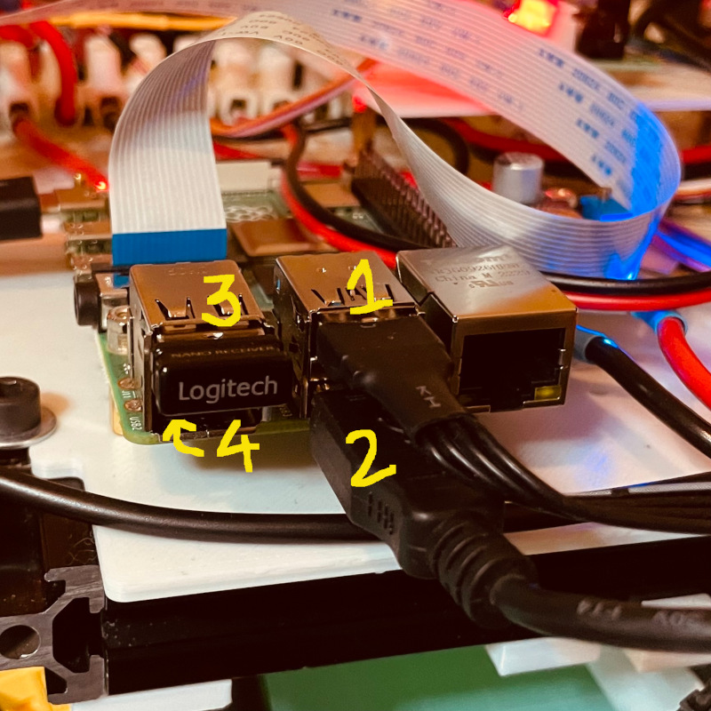

## Connect gamepad directly to the robot

We bought the Logitech 710 with a USB dongle. Allows running `/joy_node` from the bot, less lag, no need to carry the laptop around.

## Write a Python node to monitor `/joy` topic and send commands to the Arduino 

I wrote  [joy_subscriber.py](./sevillabot/scripts/joy_subscriber.py)

To get a mapping of your gamepad:

```bash
(T1):$ ros2 run joy joy_node
(T2):$ ros2 topic echo /joy
```

The Logitech 710 has two modes: X and D.  Instructions recommend mode X but the mapping seems strange. Note for example Left joystick only has discrete values in mode X.
Note also that MODE and VIBRATION do not trigger any response in `/joy` topic

|             | Mode X                                                       | Mode D                                                       |
| ----------- | ------------------------------------------------------------ | ------------------------------------------------------------ |
| buttons[0]  | A                                                            | X                                                            |
| buttons[1]  | B                                                            | A                                                            |
| buttons[2]  | X                                                            | B                                                            |
| buttons[3]  | Y                                                            | Y                                                            |
| buttons[4]  | LB                                                           | LB                                                           |
| buttons[5]  | RB                                                           | RB                                                           |
| buttons[6]  | BACK                                                         | LT                                                           |
| buttons[7]  | START                                                        | RT                                                           |
| buttons[8]  | ?                                                            | BACK                                                         |
| buttons[9]  | Left Stick Push on                                           | START                                                        |
| buttons[10] | Right Stick Push on                                          | Left Stick Push on                                           |
| buttons[11] |                                                              | Right Stick Push on                                          |
| axes[0]     | Cross Left/Right. Discrete values Left= +1. None = 0, Right = -1 | Left Stick Left/Right. Float values from +1 (Left) to -1 (Right) |
| axes[1]     | Cross Up/Down. Discrete values Up = +1, None = 0, Down = -1  | Left Stick Up/Down. Float values from +1 (Up) to -1 (Down)   |
| axes[2]     | LT. Float values from +1 (Not pressed) to -1 (Fully pressed) | Right Stick Left/Right. Float values from +1 (Left) to -1 (Right) |
| axes[3]     | Right Stick Left/Right. Float values from +1 (Left) to -1 (Right) | Right Stick Up/Down. Float values from +1 (Up) to -1 (Down)  |
| axes[4]     | Right Stick Up/Down. Float values from +1 (Up) to -1 (Down)  | Cross Left/Right. Discrete values Left= +1. None = 0, Right = -1 |
| axes[5]     | RT. Float values from +1 (Not pressed) to -1 (Fully pressed) | Cross Up/Down. Discrete values Up = +1, None = 0, Down = -1  |
| axes[6]     | Left Stick Left/Right. Discrete values Left= +1. None = 0, Right = -1 |                                                              |
| axes[7]     | Left Stick Up/Down. Discrete values Up = +1, None = 0, Down = -1 |                                                              |

## Fix the project to compile the node `joy_subscriber.py`. 

I found the fix here:
https://answers.ros.org/question/299269/ros2-run-python-executable-not-found/

- Add the Python source file to `sevillabot/scripts`
- Add an empty `__init__.py` file in the folder `sevillabot/scripts`
- Make sure the file is executable with `chmod +x joy_subscriber.py`

- Make sure the first line of code is the python shebang:  `#!/usr/bin/env python3`
- In `CMakeLists.txt`:

> ```
> # Install Python executables
> ament_python_install_package(scripts)
> 
> ...
> 
> install(
> 	PROGRAMS scripts/joy_subscriber.py  
>   	DESTINATION lib/${PROJECT_NAME} 
>   )
> ```

Apparently mixing CPP and python in a package is a big deal, see more details here:
https://roboticsbackend.com/ros2-package-for-both-python-and-cpp-nodes/

Not sure how I got it to work the first time but I am pretty sure I didnt add the `install ( PROGRAMS...` part.

To compile:

```bash
$ cd ~/robot_ws
$ colcon build --symlink-install 
$ source install/setup.bash
```

## Quick start

To run you need to open several ssh terminals, source and run different nodes:

```bash
(bot1):$ ros2 launch sevillabot launch_robot.launch.py # spawns bot
(bot2):$ ros2 launch sevillabot joystick.launch.py # launches joy_node and teleop_node with params and remapping of cmd_vel
(bot3):$ ros2 run sevillabot joy_subscriber.py # launch joy_subscriber
```

## Note on unique Arduino addresses

`/dev/ttyUSB*` depends of plugging order

`/dev/serial/by-id/*` is supposedly an unique ID but all my Arduino nanos share the same!: `/dev/serial/by-id/usb-1a86_USB2.0-Ser_-if00-port0`

`/dev/serial/by-path/*` depends on where the device is physically connected  (which USB port). Could work if we assign dedicated USB ports to specific Arduinos and are consistent with it.

| RPi4 USB port position | `/dev/serial/by-path/*` address of Arduino nano |
| -- | -- |
| top right | `/dev/serial/by-path/platform-fd500000.pcie-pci-0000:01:00.0-usb-0:1.1:1.0-port0` |
| bottom right | `/dev/serial/by-path/platform-fd500000.pcie-pci-0000:01:00.0-usb-0:1.2:1.0-port0` |
| top right | `/dev/serial/by-path/platform-fd500000.pcie-pci-0000:01:00.0-usb-0:1.3:1.0-port0` |
| bottom left | `/dev/serial/by-path/platform-fd500000.pcie-pci-0000:01:00.0-usb-0:1.4:1.0-port0` |

Found using:

```bash
$ ls -l /dev/ttyUSB* # detects serial devices
$ udevadm info /dev/ttyUSB0 # gets info for each device
```



Assignment of sevillabot USB ports: Arduino for Base robot in 1, Addon Arduino in 2, Gamepad dongle in 3, 4 is spare


Modified both [ros2_control.xacro](./sevillabot/description/ros2_control.xacro) and [joy_subscriber.py](./sevillabot/scripts/joy_subscriber.py) to use  `/dev/serial/by-path/*` instead of `/dev/ttyUSB*` or `/dev/serial/by-id/*`

And now it works!

Note: the stepper motor just waiting consumes ~0.25A*12V = 3W!! And it gets hot!!  

--

After installing the Mega, the addresses by-id and by-path change:

| Mega4 USB port position (when plugged on top-right RPi USB port) | `/dev/serial/by-path/*` address                              | `/dev/serial/by-id/*` address                                |
| ------------------------------------------------------------ | ------------------------------------------------------------ | ------------------------------------------------------------ |
| left: LiDAR                                                  | `/dev/serial/by-path/platform-fd500000.pcie-pci-0000:01:00.0-usb-0:1.2.2:1.0-port0` | `/dev/serial/by-id/usb-Silicon_Labs_CP2102_USB_to_UART_Bridge_Controller_0001-if00-port0` |
| center: robot base Arduino                                   | `/dev/serial/by-path/platform-fd500000.pcie-pci-0000:01:00.0-usb-0:1.2.3:1.0-port0` | `/dev/serial/by-id/usb-1a86_USB2.0-Ser_-if00-port0`          |
| right: gamepad dongle                                        | NA                                                           | NA                                                           |
| side: not accessible due to buck converter                   | NA                                                           | NA                                                           |

