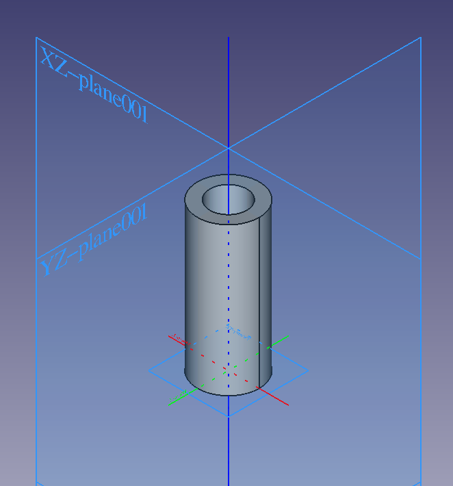

## Inertial properties

Tutorials recommend [Solidworks Exporter](http://wiki.ros.org/sw_urdf_exporter) to calculate inertial properties (mass, centre of mass, inertia tensor) from CAD models . However I have designed in FreeCAD. 

I found sources for several methods to obtain inertial properties from FreeCAD models:

* Method 1 - directly in FreeCAD: see [JOKO Engineeringhelp - video tutorial on obtaining mass properties in FreeCAD](https://www.youtube.com/watch?v=gThQk-4p1CY)

* Method 2: This [Gazebo answers Q&A](https://answers.gazebosim.org//question/28772/meshlab-calculate-moments-of-inertia-not-assuming-density-of-1/) links to this excellent [tutorial on Inertial parameters of triangle meshes](https://classic.gazebosim.org/tutorials?tut=inertia&cat=build_robot) which recommends using [Meshlab](https://www.meshlab.net/) and also has a great discussion

* Method 3: this [tutorial](https://www.youtube.com/watch?v=CPViCzK7CUo&t=1809s) to approximate inertia for any 3D object using voxels

* Not explored yet: [Release of RobotCAD (FreeCAD OVERCROSS) v2.0.0](https://discourse.ros.org/t/released-v2-0-0-robotcad-freecad-overcross/38969) - workbench to generate robot description packages (xacro or URDF) for ROS2 - [official Github repo](https://github.com/drfenixion/freecad.overcross)

* Not explored yet: [Discussion on Tools and Best Practices for 3D Robot Assets (URDF, SDFormat, CAD, etc)](https://discourse.ros.org/t/discuss-tools-and-best-practices-for-3d-robot-assets-urdf-sdformat-cad-etc/36997)


## `<inertial>` tag

Example `<inertial>` tag:

```xml
<inertial>
    <origin xyz="-0.00000e+00 -0.00000e+00 3.00000e-02" rpy="0 0 0" />
    <mass value="2.00000e-01"/>
    <inertia ixx="7.0577869e-05" ixy="1.3099873e-13" ixz="-4.4938763e-14" iyy="7.0577869e-05" iyz="0.0000000e+00" izz="2.1155751e-05"/>
</inertial>
```

The `<mass>` should be entered in kilograms and you have to find it out experimentally (or from specifications, e.g. density x calculated volume): **measured mass (kg)**

The `<origin>` is used to enter the Center of Mass position (relative to the link's  origin; especially not relative to the link's visual or collision origin): **Center of mass coordinates (m).**

If you estimated the center of mass experimentally, fill in this value, otherwise fill in the correctly scaled value computed from the model. *The rotational elements can define a different coordinate for the moment of inertia axes.* (Meaning??)

The `<inertia>` tag contains the inertia tensor. Since the matrix is symmetric, only 6 numbers are sufficient to represent it:

```
| ixx ixy ixz |
| ixy iyy iyz |
| ixz iyz izz |
```

Quick check of tensor: 

* diagonal entries should have the largest values and be positive, and the off-diagonal numbers should more or less approach zero.
* The matrix has to be positive definite (use your favorite maths tool to verify that). 
* Its diagonal entries also have to [satisfy the triangle inequality](http://physics.stackexchange.com/a/48273), ie. `ixx + iyy >= izz`, `ixx + izz >= iyy` and `iyy + izz >= ixx`.

## Example 1 - bushing

As example we create a hollow cylinder (bushing) with the following properties:

- height: 60mm
- Outer diameter: 25mm 
- Inner diameter: 15mm 
- mass: 200g

Original FreeCAD model [bushing.FCStd](./assets/bushing.FCStd) | Exported STL [bushing.stl](./assets/bushing.stl)



### Theoretical inertia tensor

The inertia tensor according to ChatGPT:

```
[[7.0625e-05 0.0000e+00 0.0000e+00]
[0.0000e+00 7.0625e-05 0.0000e+00]
[0.0000e+00 0.0000e+00 2.1250e-05]]
```

Can be checked manually with the formulas in [Wikipedia](https://en.wikipedia.org/wiki/List_of_moments_of_inertia#List_of_3D_inertia_tensors), or running `bushing_sample.py`, a python script that implements the formulas. It yields the same result, so we take this as a reference. 

### Method 1 - FCInfo macro in FreeCAD

cfr. [JOKO Engineeringhelp - video tutorial on obtaining mass properties in FreeCAD](https://www.youtube.com/watch?v=gThQk-4p1CY)

1. In FreeCAD install the Addon macro **FCInfo**

2. Open the FreeCAD model and select the **Body**

3. **Macro -> Macros... -> User macros -> FCInfo.FCMacro -> Execute**

This macro opens s side panel that allows clicking to get point coordinates, perimeters and surfaces of selected faces, as well as volume, mass and inertia tensor of bodies.

4. Enter density (or adjust manually to reach measured mass), in our case, to get 200g mass: density = 10.61kg/dm³ 
5. Scroll down and create a **Spreadsheet** with the data
6. Export it as CSV: **Spreadsheet Workbench -> Menu Spreadsheet -> Export spreadsheet**:  `bushing_freecad_data.csv`

```
...
'Matrix inertia massique	'gmm2				
' X:	70622.8065	' Y:	0	' Z:	-0
' X:	0	' Y:	70622.8065	' Z:	0
' X:	-0	' Y:	0	' Z:	21249.34
...
```

6. Remember you need to convert units. In our case:  g mm2 = 10⁻⁹ Kg m2. Manually:

```
Matrix inertia(kgm2)				
[[7.06228065e-5	0	-0]
[0	7.06228065e-5	0]
[-0	0	2.124934e-5]]
```

It checks!

Pending:

- [ ] write a python script to read from this CSV file the center of mass coordinates, volume, moment of inertia etc and generate the <inertial> tag. Note: careful, the CSV generated by FreeCAD keeps all the saves one after another, the script should take the most recent!!

### Method 2: Meshlab

Install meshlab from AppImage (version 2023):

1. Open a STL or DAE model

2. **Filters > Quality Measure and Computations > Compute Geometric Measures** to compute inertial values

3.  manually copy the output to a text file `bushing_meshlab_data.txt` :

```
...
Mesh Bounding Box Size 25.000000 24.930096 60.000000
...
Mesh Volume is 18807.816406
Center of Mass is -0.000000 -0.000000 30.000002
Inertia Tensor is :
| 6637078.000000 0.012319 -0.004226 |
| 0.012319 6637078.000000 0.000000 |
| -0.004226 0.000000 1989467.375000 |
...
```

Note: inertia tensor is in mm⁻⁵ , needs to be converted to m⁻⁵ then multiplied by the density in Kg/m³ :  

* 1 mm⁻⁵ = 1e-15 m⁻⁵

* Density = .2 Kg / 1.8807816406e-5 m³ =1.0633877e4 Kg/m3 

So the factor is 1.0633877e-11. Manually:

```Matrix inertia(kgm2)				
[[7.057787*e-5	~1e-11	~1e-11]
[~1e-11	7.057787*e-5	~1e-11]
[~1e-11	~1e-11	2.115575*e-5]]
```

The python script `inertial.py`  automates writing the <inertial> tag from the Meshlab log.

weight_factor = **measured mass (kg)** / `Mesh Volume`

length_factor = **measured bounding box (m)** / `Mesh Bounding Box Size`

**Center of mass coordinates (m)** = Center of Mass * length_factor

**i<sub>xy</sub> (kg*m<sup>2</sup>)** = weight_factor * length_factor<sup>2</sup>* `i_xy`* **s**<sup>-5</sup>

Output of running `inertial.py` script on `bushing_meshlab_data.txt` (the output of Meshlab on `bushing.stl`) is quite correct:

```xml
<inertial>
	<origin xyz="-0.00000e+00 -0.00000e+00 -0.00000e+00" rpy="0 0 0" />
	<mass value="2.00000e-01"/>
	<inertia ixx="7.0577880e-05" ixy="1.3099873e-13" ixz="0.0000000e+00" iyy="7.0577880e-05" iyz="-0.0000000e+00" izz="2.1155751e-05"/>
</inertial>
```

Tips and tricks in Meshlab:

Try **Filters > Cleaning and Repairing > Remove Duplicate Faces** to remove duplicate faces if needed

If values are too low and precision is lost: **Filters > Normals, Curvatures and Orientation > Transform: Scale** scale by **s**=10 or 100 (then later need to correct inertial values by 1/**s**⁵)

### Method 3 - Voxel approximation

cfr: https://www.youtube.com/watch?v=CPViCzK7CUo&t=1809s

Voxelize the STL using e.g. [voxelizer](https://drububu.com/miscellaneous/voxelizer/index.html?out=txt)


```bash
$ python3 voxel_inertia.py 
{'max_dimensions': [124.0, 124.0, 299.0], 'volume': 185956, 'center_of_mass': [0, 0, 0], 'inertia_tensor': {'i_xx': 10182.42249522264, 'i_yy': 10183.705798799883, 'i_zz': 2935.151186301868, 'i_xy': 1.2039471023613897e-10, 'i_xz': 1.5628747777305165, 'i_yz': -1.3182799040042368}}
Enter the measured mass in kg: .2
Mesh max_dimensions vector: [124.0, 124.0, 299.0]
Enter the dimension to scale (x, y, z)?: z
Enter a measured dimension in meters for scale: .6
<inertial>
    <origin xyz="0.00000e+00 0.00000e+00 0.00000e+00" rpy="0 0 0" />
    <mass value="2.00000e-01"/>
    <inertia ixx="4.4099233e-08" ixy="5.2141957e-22" ixz="6.7686819e-12" iyy="4.4104791e-08" iyz="-5.7093617e-12" izz="1.2711898e-08"/>
</inertial>
```

## Example 2: a box


A simple box:

* x: 90mm
* y: 60mm
* z: 30mm

* mass: 1.5kg

Original FreeCAD model [box_90x60x30.FCStd](./assets/box_90x60x30.FCStd) | Exported STL [box_90x60x30.stl](./assets/box_90x60x30.stl)

### Theoretical inertia tensor

```python
[[5.625e-4, 0.0, 0.0],
    [0.0, 1.125e-3, 0.0],
    [0.0, 0, 1.4625e-3]]
```

### Method 1 - FCInfo macro in FreeCAD

Adjust density = 9.2593 kg/dm³ to get mass ~1.5 kg 

Export Spreadsheet to `box_90x60x30_freecad_data.csv`

```
'Matrix inertia massique	'gmm2				
' X:	562502.475	' Y:	0	' Z:	0
' X:	0	' Y:	1125004.95	' Z:	0
' X:	0	' Y:	0	' Z:	1462506.435
```

Convert units: 1 g mm² = 10⁻⁹ Kg m²

```python
[[5.62502475e-4,	0,	0]
[0,	1.12500495e-3,	0]
[0,	0,	1.462506435e-3]]
```

### Method 2: Meshlab

Opened `box_90x60x30.stl` in Meshlab and analyzed. Manually copied the log output to a text file `box_90x60x30_meshlab_data.txt` :

```
...
Mesh Bounding Box min -45.000000 -30.000000 -15.000000
Mesh Bounding Box max 45.000000 30.000000 15.000000
Mesh Volume is 162000.000000
Center of Mass is 0.000000 0.000000 0.000000
Inertia Tensor is :
| 60750000.000000 0.000000 0.000000 |
| 0.000000 121500000.000000 0.000000 |
| 0.000000 0.000000 157950000.000000 |
...
```

Note: inertia tensor is in mm⁵ , needs to be converted to m⁵ then multiplied by the density in Kg/m³ :  

* 1 mm⁵ = 1e-15 m⁵

* Density = 1.5 Kg / 1.62e-4 m³ =9.25926e+3 Kg/m3 

So the factor is 9,25926e-12. Manually:

```Matrix inertia(kgm2)				
[[5.6250e-4	0	0]
[0	1.125e-3	0]
[0	0	1.46250012e-3]]
```

### Method 3 - Voxel approximation

Voxelize the STL using e.g. [voxelizer](https://drububu.com/miscellaneous/voxelizer/index.html?out=txt) 


Actually created 3 versions:

Output with [box_90x60x30_voxel_9x3x6.txt](./inertia/test_samples/box_90x60x30_voxel_9x3x6.txt) 

```
<inertia ixx="7.3276119e-04" ixy="-0.0000000e+00" ixz="-0.0000000e+00" iyy="1.4453731e-03" iyz="-0.0000000e+00" izz="1.8879851e-03"/>
```

With [box_90x60x30_voxel_90x30x60.txt](./inertia/test_samples/box_90x60x30_voxel_90x30x60.txt):

``` 
<inertia ixx="5.0892461e-04" ixy="-0.0000000e+00" ixz="-0.0000000e+00" iyy="8.9406903e-04" iyz="-0.0000000e+00" izz="1.1507949e-03"/>
```

With [box_90x60x30_voxel_900x300x600.txt](./inertia/test_samples/box_90x60x30_voxel_900x300x600.txt):

```
 <inertia ixx="5.1003402e-04" ixy="-8.7047660e-07" ixz="-7.5568927e-06" iyy="8.1515719e-04" iyz="3.8551550e-07" izz="1.0656610e-03"/>
```

Does not seem to converge...
