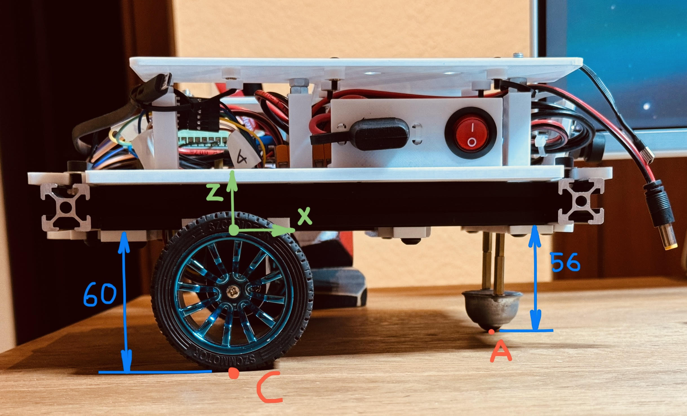

# CoG from weighing

A: contact point of castor

B: contact point of left wheel

C: contact point of right wheel

Coordinate frame: 

XY plane on lower face of Aluminum frame

X middle point between wheels pointing forward

Z pointing upwards

Y pointing left to follow right hand convention

 

 

| Measured dimensions | x (mm) | y (mm) | z (mm) |
| ------------------- | ------ | ------ | ------ |
| A                   | 131    | 0      | -56    |
| B                   | 0      | 102    | -60    |
| C                   | 0      | -102   | -60    |

To calculate x coordinate of A:

l' ² + 102² = 166² -> l' ~= 131 mm

l²+4² = l'² -> l ~= 131 mm (no effect of the 4mm )

| Raised: 9.3mm | W_A (g) | W_B (g) | W_C (g) | Sum (g) |
| ------------- | ------- | ------- | ------- | ------- |
| None          | 545.7   | 708.8   | 641.3   | 1895.8  |
| A             | 511.8   | 719.2   | 665.0   | 1896    |
| B             | 586.5   | 684.0   | 624.8   | 1895.3  |
| C             | 589.2   | 696.5   | 609.8   | 1895.5  |

W = 1895.7 g

Subtract weight of wheels: 45.4 g each on points B and C

Subtract weight of castor: 47.1g on point A

Result: 1757.8g
