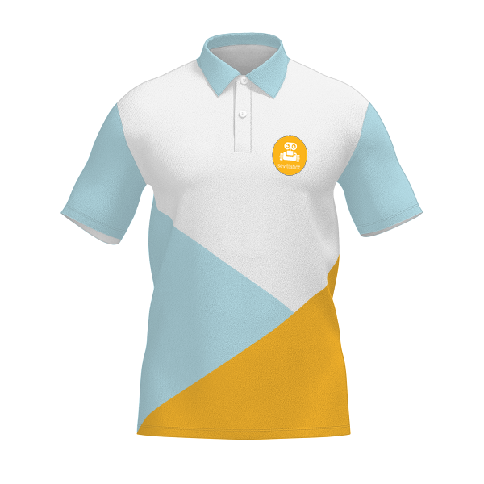
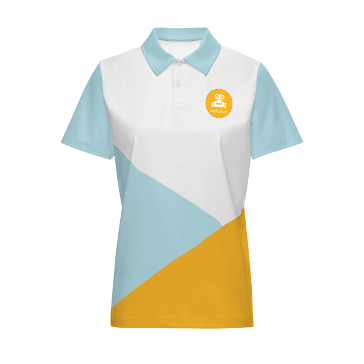
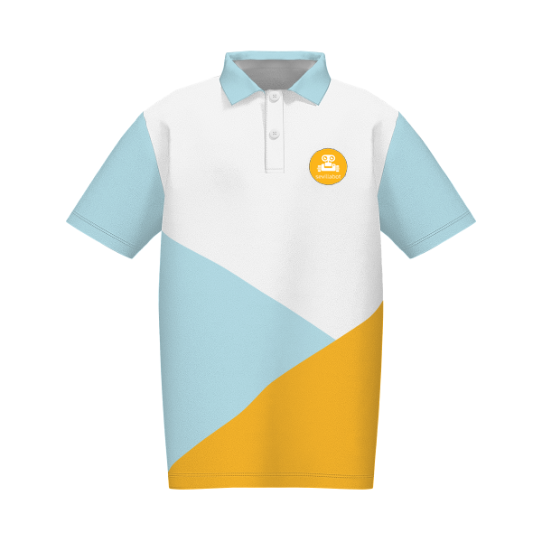

# Chic happens

The date of Piwars 2024 is approaching, and the **Sevillabot** team is going all out to get ready for the event, and do it in style!!

Working against the clock to finish all aspects of our robot is only one aspect of the preparations we need to take care about. 

We have already booked our plane tickets and accommodation, and we are well advanced making arrangements for the transportation of our robot. 

But there was one important open item in our to do list, and today we took care of it: designing and ordering stylish team uniforms 

| Man                   | Woman                  | Child                   |
| --------------------- | ---------------------- | ----------------------- |
|  |  |  |

We designed custom t-shirts, personalized them with the **Sevillabot** and **Pi Wars** logos, the Spanish flag, and even the name of each team member. Today we placed our order from https://www.vistaprint.es/  and are looking forward to receive them by 1st April !!
